# 基于文件指针的文件模式

## 文件的创建，打开与关闭
fopen以mode的方式打开或创建文件，如果成功，将返回一个文件指针，失败则返回NULL。
FILE* fopen(const char* path, const char* mode);

int fclose(FILE* stream);

## 读写文件
size_t fread(void *ptr, size_t size, size_t nmemb, FILE *stream);
size_t fwrite(void *ptr, size_t size, size_t nmemb, FILE *stream);

## fopen的a a+ 模式
FILE 文件流/用户态文件缓冲区
* a 只写追加    默认从文件结尾写入
* a+ 读写追加   打开时处于文件开始，写入时跳到文件末尾
流 ：ptr 每次读写自动后移

## 文件的权限chmod
int chmod(const char* path, mode_t mode);
mode_t 无符号32位八进制数

# 目录操作

## 获取、改变当前目录
### getcwd
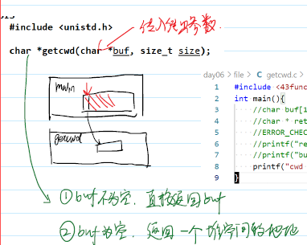

### chdir
只改变子进程
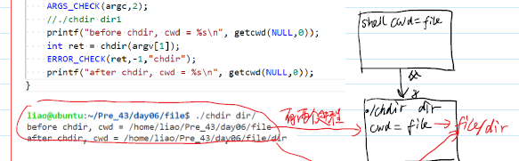

## 创建和删除目录
### mkdir rmdir
所有创建文件的行为都会受到 umask 的影响

## 目录的存储原理
### **目录流**
* 链表 + ptr
目录流 - 目录文件在内存中的缓冲区
ptr 自动后移- 用户可以不了解结构访问所有数据
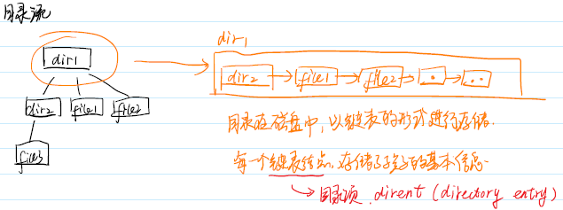

* opendir
DIR *opendir(const char *name);
* closedir
int closedir(DIR *dirp);
* readdir
struct dirent *readdir(DIR *dirp);
struct dirent - 目录项

### stat
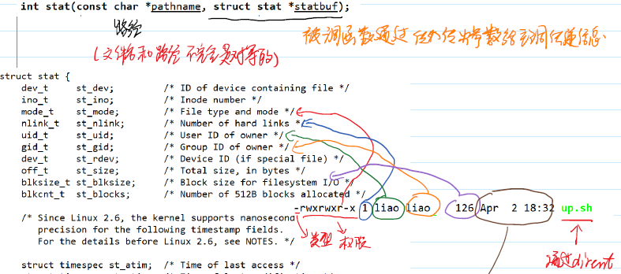
- 类型和权限
st_mode 32位
- 硬链接数
l
- uid
getpwuid
- gid
getgrgid
- 大小
st_size
- 时间
mtime 长整型 计算机时间
日历时间    ctime
localtime   精确控制

### 自己实现tree命令
对文件树采用深度优先遍历
深度优先遍历用递归/栈
广度优先遍历用队列

# 不带缓冲区的文件IO
不带用户态缓冲区
文件对象
文件描述符
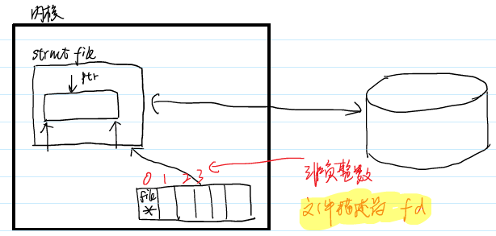
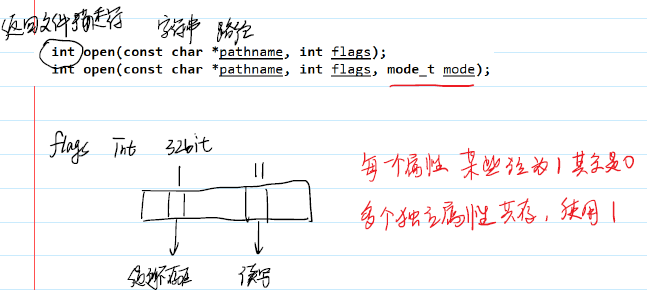
## 属性
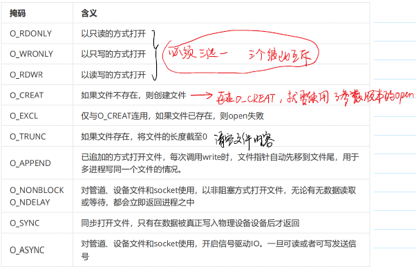

## open close
\#include <fcntl.h>
int open(const char *pathname, int flags);
int open(const char *pathname, int flags, mode_t mode);
```c
#include <myself.h>
int main(int argc, char *argv[]) {
    // ./open file1
    ARGS_CHECK(argc,2);
    //int fd = open(argv[1], O_WRONLY);
    //int fd = open(argv[1],O_WRONLY|O_CREAT,0666);
    //创建文件行为，总是会受到umask影响
    int fd = open(argv[1],O_WRONLY|O_CREAT|O_EXCL,0666);
    ERROR_CHECK(fd,-1,"open");
    printf("fd = %d\n",fd);
    close(fd);
}
```
fopen底层调用了open

## 读写文件read write
### read write
 ssize_t read(int fd, void *buf, size_t count);
返回值：>0 成功读取的字符数 =0 文件终止符 -1 报错
 ssize_t write(int fd, const void *buf, size_t count);

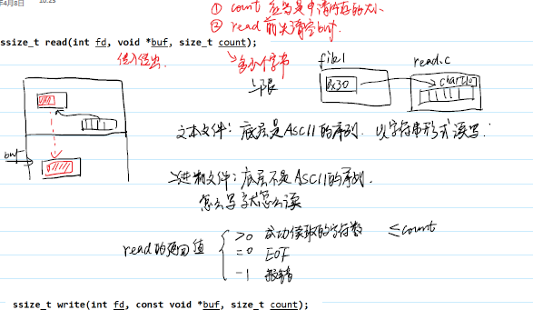

```c
#include <myself.h>
int main(int argc, char *argv[]) {
    ARGS_CHECK(argc,2);
    int fd = open(argv[1], O_RDWR);
    ERROR_CHECK(fd,-1,"open");
    printf("fd = %d\n",fd);
    char buf[10] = {0};
    ssize_t ret = read(fd,buf,sizeof(buf));
    ERROR_CHECK(ret,-1,"read");
    puts(buf);
    close(fd);
}
```

```c
#include <myself.h>
int main(int argc, char *argv[]) {
    ARGS_CHECK(argc,2);
    int fd = open(argv[1], O_RDWR);
    ERROR_CHECK(fd,-1,"open");
    printf("fd = %d\n",fd);
    // char buf[10] = "hello";//这里如果是字符串，就是文本文件
    // write(fd,buf,strlen(buf));
    int i = 10000000;
    write(fd,&i,sizeof(i));
    close(fd);
}
```
二进制文件更好

### **实现cp命令**
申请空间buf，先read，再write。
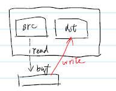
网盘项目在此基础上
```c
#include <myself.h>
int main(int argc, char *argv[]) {
    // ./cp src des
    ARGS_CHECK(argc,3);
    int fdr = open(argv[1],O_RDONLY);
    ERROR_CHECK(fdr,-1,"open fdr");
    int fdw = open(argv[2],O_WRONLY | O_CREAT | O_TRUNC，0666);
    ERROR_CHECK(fdw,-1,"open fdw");
    char buf[4096] = {0};
    while(1) {
        //先清空
        memset(buf,0,sizeof(buf));
        ssize_t ret = read(fdr,buf,sizeof(buf));
        if (ret == 0) {
            break;
        }
        write(fdw,buf,ret);//第三个参数ret，表示读多少写多少。
    }
    close(fdr);
    close(fdw);
}
```

### 性能问题
- read
用户态陷入内核态。
buf越大越好（4096），减少状态切换的次数

- 使用文件流 fread fwrite
1优势：零碎的写入，少量的系统调用
2劣势：拷贝次数更多

## 文件的截断ftruncate
int ftruncate(int fd, off_t length);
大 -> 小    截断末尾
小 -> 大    补0
可以用来创建一个固定大小的文件

## 内存映射mmap
用户态内存与磁盘建立映射，实现用[]就可以访问
void *mmap(void *addr, size_t length, int prot, int flags,int fd, off_t offset);

int munmap(void *addr, size_t length);

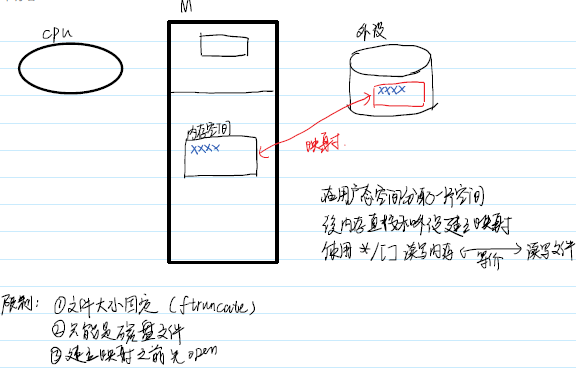

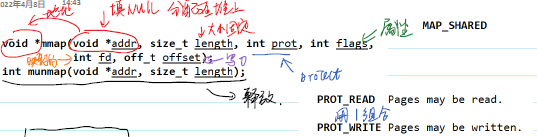


## lseek
off_t lseek(int fd, off_t offset, int whence);
可以引起文件空洞
* lseek 与 fseek
lseek：操作内核态，直接改变磁盘文件
fseek：操作用户态

## 文件流底层使用了文件对象
面向接口编程
文件流打开就用文件流方式操作 fopen - fread fwrite
文件描述符打开就用文件描述符操作 open - read write

```c
#include <myself.h>
int main (int argc, char *argv[]) {
    // ./fileno file1
    ARGS_CHECK(argc,2);
    FILE *fp = fopen(argv[1],"r+");
    ERROR_CHECK(fp,NULL,"fopen");
    printf("fileno = %d\n", fileno(fp));
    //int ret = write(3,"hello",5); //3是魔法数
    // int ret = write(fp->_fileno,"hello",5); //代码即注释
    int ret = write(fileno(fp),"hello",5); //面向接口编程
    ERROR_CHECK(ret,-1,"write");
    fclose(fp);
}
```
获取文件描述符
int fileno(FILE *stream);

## printf对应的fd是1
printf -> write(1)
如果先close(1),再open一个文件（该文件的fd是1）
再使用printf -> write(1)
把1不指向屏幕

## dup文件描述符的复制
两个文件描述符指向同一地方
1. 数值上不同
2. 偏移量共享

int dup(int oldfd);
选择一个最小可用的fd，和oldfd同指向

int dup2(int oldfd, int newfd);
让newfd与oldfd指向同一文件对象，如果newfd还有指向，就会自动close。

引用计数，记录有几个关联的描述符，直至所有的释放再close。

实现重定向。

## 有名管道
named pipe / FIFO
是进程间通信机制在文件系统的映射

传输方式：
单工    A -> B
半双工  A -> B | B-> A 不同时
全双工  A <-> B

mkfifo - make FIFOs (named pipes)

## 用系统调用操作管道
open 
O_WRONLY    写端
O_RDONLY    读端

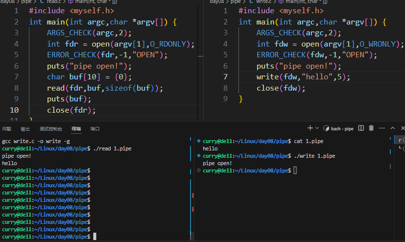
open会导致阻塞

当一个进程打开了（open）了管道一端时，如果对端未被打开，进程处于阻塞状态，直到对端被另一个进程打开。

## 死锁的产生
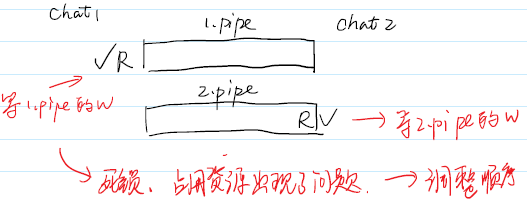

解决：
调整顺序
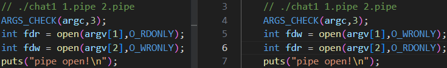

## 全双工通信
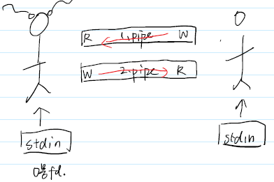

## **引入 IO 多路复用**
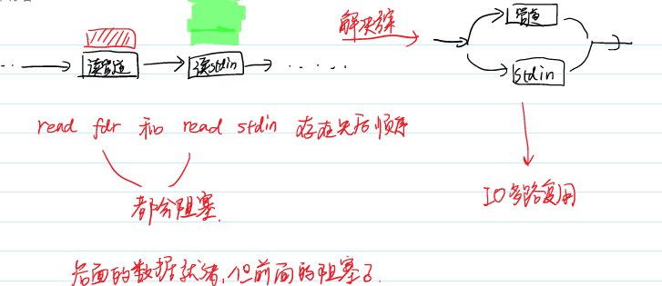
集中管理多个导致阻塞的事件

### **select**
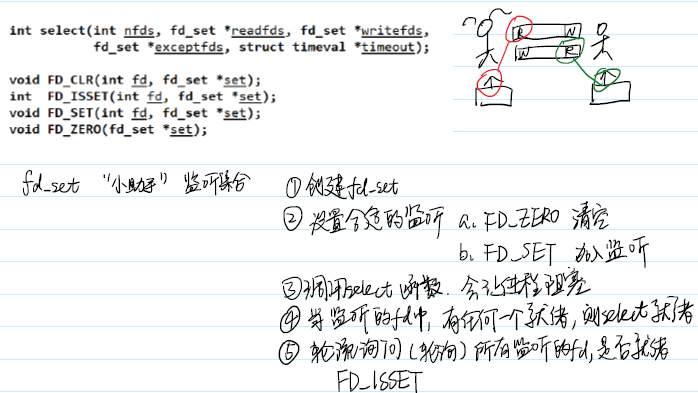

\#include <sys/select.h>

int select(int nfds, fd_set *readfds, fd_set *writefds,fd_set *exceptfds, struct timeval *timeout);

void FD_CLR(int fd, fd_set *set);

int  FD_ISSET(int fd, fd_set *set);

void FD_SET(int fd, fd_set *set);

void FD_ZERO(fd_set *set);

fd_set -监听集合
1. 创建fd_set
2. 设置合适的fd监听
        FD_ZERO 清空
        FD_SET  加入监听
3. 调用select 函数，会让进程阻塞
4. 当监听的fd中，有任何一个就绪，则select就绪
5. 轮流询问（轮询）所有监听的fd，是否就绪FD_ISSET
```c
#include <myself.h>
int main(int argc, char *argv[]) {
    // ./chat1 1.pipe 2.pipe
    ARGS_CHECK(argc,3);
    int fdr = open(argv[1],O_RDONLY);
    int fdw = open(argv[2],O_WRONLY);
    puts("pipe open!");
    char buf[4096] = {0};
    fd_set rdset;
    while(1) {
        FD_ZERO(&rdset);
        FD_SET(fdr,&rdset);
        FD_SET(STDIN_FILENO,&rdset);
        select(fdr+1,&rdset,NULL,NULL,NULL);
        if(FD_ISSET(STDIN_FILENO,&rdset)) {
            puts("msg from stdin");
            memset(buf,0,sizeof(buf));//清空
            read(STDIN_FILENO,buf,sizeof(buf));
            write(fdw,buf,strlen(buf));//向管道fdw写，有多少写多少
        }
        if(FD_ISSET(fdr,&rdset)) {
            puts("msg from pipe");
            memset(buf,0,sizeof(buf));//清空
            read(fdr,buf,sizeof(buf));//从管道fdr读
            puts(buf);
        }
    }
}
```

### 如果一方关闭了聊天
另一方陷入死循环 - 管道一直就绪导致的

① 写端先关闭 - 读端read会读到EOF（就绪）
② 读端关闭 - 写端继续write（进程崩溃，SIGPIPE信号）

ctrl + d 给标准输入 输入一个EOF
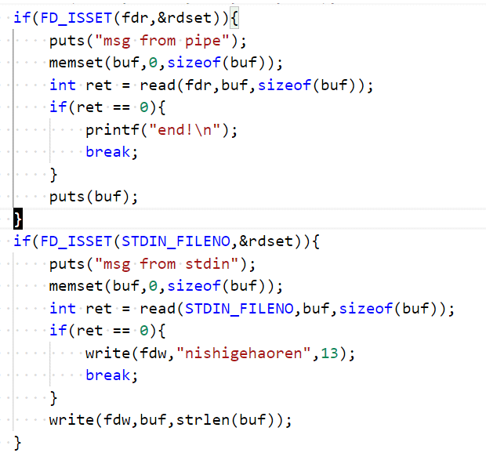

### select超时
struct timeval *timeout

struct timeval {
time_t      tv_sec;   /* seconds \*/
suseconds_t tv_usec;  /* microseconds */
};

timeout也是传入传出参数，每次循环开始时要设置timeout

使用select的返回值，来区分导致的就绪
0 超时
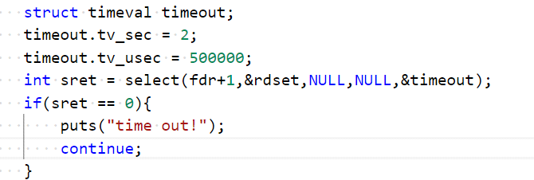

### 关于管道
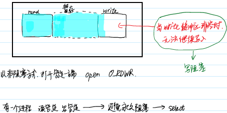
 
### 使用select同时监听读和写
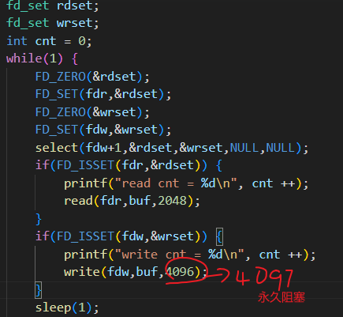

select认为写就绪的条件 - 写缓冲区为空

### select实现的原理
fd_set 本质是一个位图

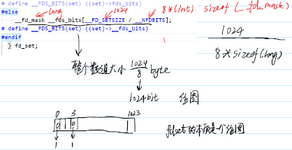

调用select
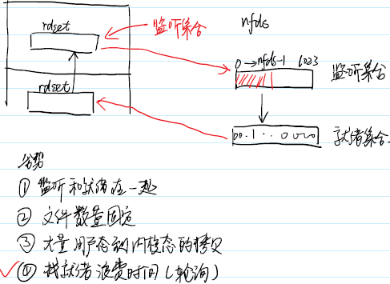

