# 1 进程定义
重概念
进程：正在执行的程序
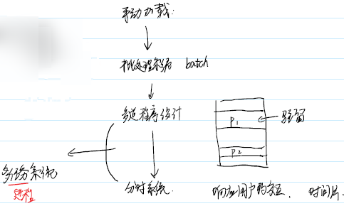

## 进程的切换
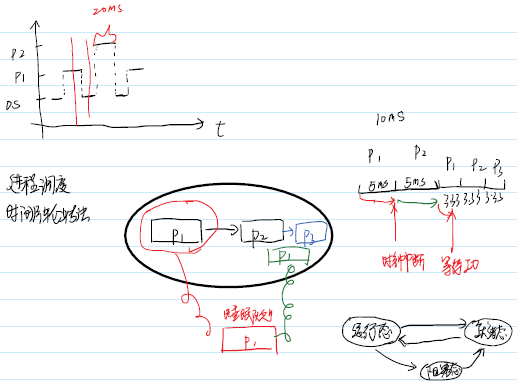
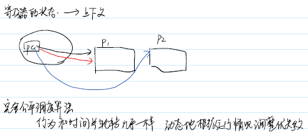

## 缺陷
- 多道程序设计
1.缺乏隔离
2.内存利用率低
3.地址使用麻烦，只能使用相对地址

利用虚拟内存 用户- 虚拟内存 - 内存
每个进程在逻辑有自己独立的内存空间

- 分时系统的缺陷
用户主动要主动放弃CPU

用户 - 虚拟CPU - CPU
让用户觉得自己是 CPU 的独占者

在某一时刻，多个进程同时进行 - 并行
在某一段时间，多个进程同时进行 - 并发

## 进程的概念
用户角度看，进程是正在进行的程序
操作系统来看，进程是资源（cpu和内存）分配的基本单元

# 2 虚拟CPU
 虚拟内存的实现
**局部性原理**
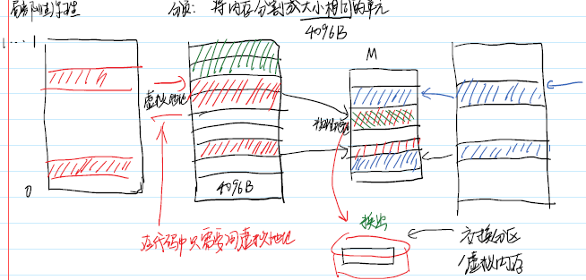
进程独享，地址从0到最大

# 3 进程管理
## 操作系统怎么样管理进程
进程：任务
教科书 - PCB 进程控制块
Linux -  task_struct 任务描述符 任务队列
task_struct 描述了进程的一切信息

## pid 进程标识符
pid是一个正整数，给用户来标识不同的进程。唯一的正整数标识符
在linux中进程存在亲缘关系

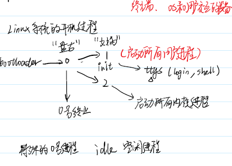

## 获取 pid
pid_t getpid(void);
pid_t grtppid(void);

同一个程序可对应多个进程

## 进程的权限
文件的权限 r w x {u,g,o}
进程权限取决于进程有什么样的身份

uid_t getuid(void); - 真实身份
uid_t geteuid(void); - 有效身份

user有可执行程序的 x 权限，通过该程序启动一个进程，进程的uid 和 euid 都是user

12位权限
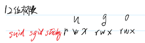

## suid权限
针对可执行程序 - 动态权限
① u 的 x 和 o 的 x 必须存在
② u 的 s 存在(suid)

O用户通过该执行程序启动的进程 euid更改为程序的拥有者

## sgid权限
针对可执行程序 - 动态权限
① g 的 x 和 o 的 x 必须存在
② g 的 s 存在(sgid)

O用户通过该执行程序启动的进程 egid更改为程序的拥有组

## sticky 粘滞位
针对目录文件
对于 o 用户，拥有 w 和 t（sticky） 权限
o 用户可以新建文件 可以删除自己的文件 不能删除别人的文件

# 4 进程的状态
在进程从创建到消亡的过程中，进程会存在很多种状态。其中最基本的三种的状态是执行态、就绪态、等待态
执行态：该进程正在运行，即进程正在占用CPU。
就绪态：进程已经具备执行的一切条件，正在等待分配CPU的处理时间片。
等待态：进程不能使用CPU，通常由于等待IO操作、信号量或者其他操作。

# 5 进程的构成
在进程本身的视角中，它除了会认为CPU是独占的以外，它还会以为自己是内存空间的独占者，这种从进程视角看到的内存空间被称为虚拟内存空间。

# 6 进程相关的命令
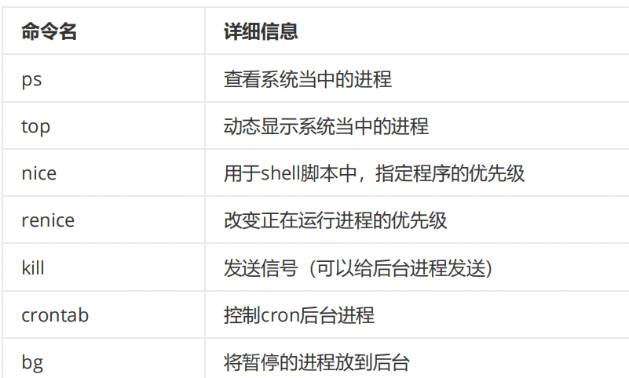

## ps-elf
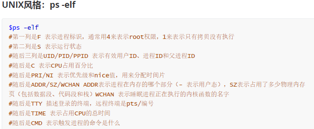

## ps aux
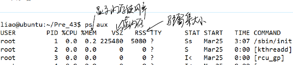

free 看内存
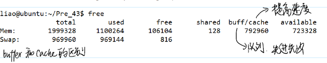

## top
获取实时的进程状态

buffers与cached区别：
buffers指的是块设备的读写缓冲区
cached指的是文件系统本身的页面缓存。
他们都是Linux系统底层的机制，为了加速对磁盘的访问。

## 优先级系统
Linux的优先级总共的范围有140，对于ubuntu操作系统而言，其范围是-40到99，优先级的数值越低，表示其优先级越高。

Linux中拥有两种类型的调度策略，分别是实时调度策略和普通调度策略。

nice值可以用来调整优先级，
其范围为-20～19。其中正数表示降低权限，负数表示提升权限。

使用nice命令和renice命令可以用来调整nice值。
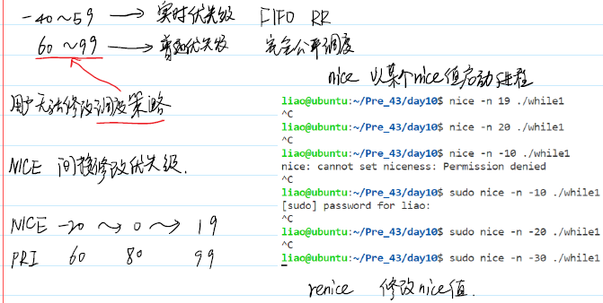

## 前台和后台
前台 可以响应键盘中断的进程
ctrl+c 表示终止信号， ctrl+z 表示暂停信号 
后台 不可以响应
当进程处于后台的时候，只能通过kill 命令发送信号给它。

使用shell启动进程的时候如果在末尾加上& 符号可以用来直接运行后台进程。

使用ctrl+z 可以暂停当前运行的前台进程，并将其放入后台。它也会输出一个任务编号到屏幕上。

使用jobs 命令可以查看和管理所有的后台任务，使用fg 命令可以将后台进程拿到前台来。使用bg 命令可以将后台暂停的程序运行起来。
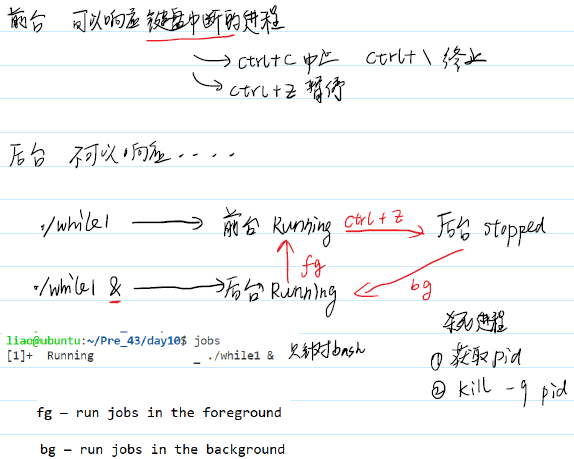

## crontab 定时任务
crontab 可以实现定期执行任务
使用crontab -e 然后选择合适的文本编辑器。或者直接用root权限打开/etc/crontab 文件

每项任务拥有六个字段，分别表示
分钟（0～60）、小时（0～23）、日期（1～31）、月份（1～12）、周（0～7 0和7都代表周日）和要执行的命令。如果是修改文件，还需要在执行命令的前面添加用户名。
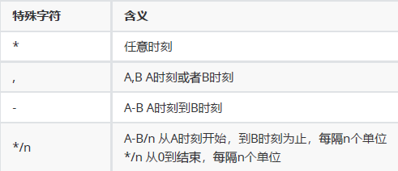

# 7 系统调用创建进程
## 在代码中启动多个进程
int system(const char *command);
system 函数可以创建一个新进程，新进程使用shell脚本执行传入的命令command。
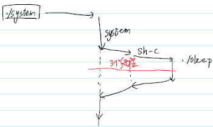

## fork系统调用
pid_t fork(void);
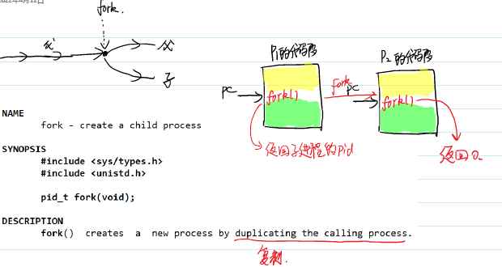
fork 用于拷贝当前进程以创建一个新进程。

fork执行以后创建的新进程和当前进程拥有着几乎一致的用户态地址空间。新进程和原进程之间存在一些小小的差异：
1. fork系统调用的返回结果不一样，子进程返回值为0，父进程返回孩子的PID
2. 父子进程之间的PPID也不一样，其中子进程的PPID的进程为它的父进程

## fork实现原理
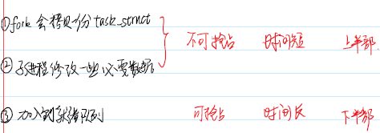

1. 首先，我们需要引入中断的概念。所谓中断，就是利用硬件发送信息给CPU，然后CPU通知操作系统处理中断事宜。

2. 异常是一个类似于中断的概念，它是进程主动发送给CPU的信息，所以也被称为软件中断。在x86体系结构当中，**系统调用**就是利用了软件中断（这个软件中断名为陷入）实现的。

3. 中断处理分成两个部分：上半部和下半部。上半部要完成一些时间短并且不能延迟的工作，比如调整硬件、或者是不能被抢占的指令。下半部会要完成一些可以稍后
执行的指令。

4. fork会“拷贝”一份进程控制块,然后修改子进程的task_struct 的内容，将PPID和PID进行调整。随后，它将子进程放入就绪度列等待调度，并将子进程fork的返回值修改为0，父进程的返回值设置为子进程的PID。

## 系统调用怎么实现
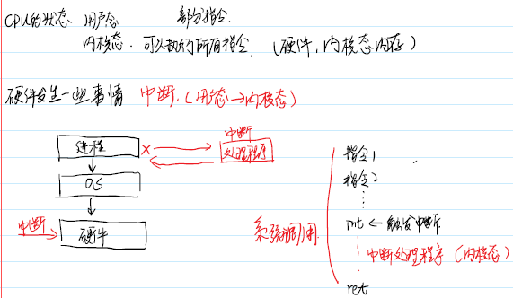

## fork性能
fork的写时复制
当执行了fork 了以后，父子进程地址空间的内容是完全一致，所以完全可以共享同一片物理内存，也就是父子进程的同一个虚拟地址会对应同一个物理内存字节。

代码段的部分因为只读，所以完全可以多个进程同时共享。而对于地址空间的其他部分，当进程对某个内存页进行写入操作的时候，我们再真正执行被修改的虚拟内存页分配物理内存并拷贝数据，这就是所谓的**写时复制**。在执行拷贝以后，同样的虚拟地址就无法对应同样物理内存字节了。

## fork的用户态拷贝
逻辑上父子进程在用户态空间（栈、堆、数据段）是拷贝的

## FILE的拷贝
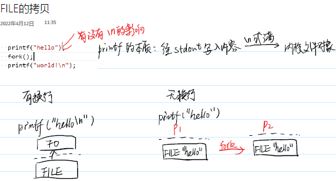

## 内核态的拷贝
内核态地址空间拷贝和用户态会有所区别。

fork 产生的子进程会拷贝一份文件描述符数组，但是通过文件描述符所指向的文件对象是共享的。

这种拷贝方式类似于dup 系统调用，所以父子进程对同一个文件对象会共享读写位置。

父子进程共享偏移量在文件是标准输出的时候非常有效，这样可以在一个终端界面上显示父子进程的输
出。
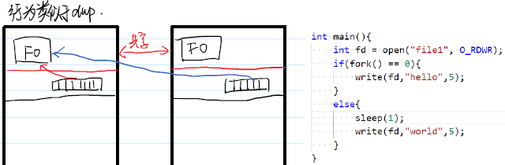

## exec函数族
exec 是一系列的系统调用。它们通常适用于在fork 之后，将子进程的指令部分进行替换修改。

当进程执行到exec系统调用的时候，它会将传入的指令来取代进程本身的代码段、数据段、栈和堆，然后将PC指针重置为新的代码段的入口。
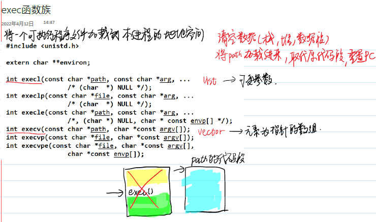

int execl(const char \*path, const char \*arg0, ... /*, (char *)0 */);

int execv(const char *path, char *const argv[]);
指针数组

实际上，我们之前所使用的system 函数以及从bash或者是其他shell启动进程的本质就是fork+exec 。

## strtok
char *strtok(char *str, const char *delim);
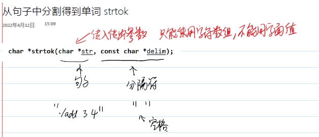

# 8 进程控制

## 8.1 孤儿进程
如果父进程先于子进程退出，则子进程成为孤儿进程，此时将自动被PID为1的进程（即init）收养。

当一个孤儿进程退出以后，它的资源清理会交给它的父进程（此时为init）来处理。但在init进程清理子进程之前，它一直消耗系统的资源，所以要尽量避免。

## 8.2 僵尸进程
如果子进程先退出，系统不会自动清理掉子进程的环境，而必须由父进程调用wait 或waitpid 函数来
完成清理工作。

如果父进程不做清理工作，则已经退出的子进程将成为僵尸进程。
僵尸进程 终止了但资源未回收。

## 8.3 wait和waitpid
wait 和 waitpid 系统调用都会阻塞父进程，等待一个已经退出的子进程，并进行清理工作。

wait 随机地等待一个已经退出的子进程，并返回该子进程的PID。

waitpid 等待指定PID的子进程；如果为-1表示等待所有子进程。

\#include <sys/wait.h>

pid_t wait(int *stat_loc);

pid_t waitpid(pid_t pid, int *stat_loc, int options);

stat_loc 是一个整型指针。如果不关心进程的退出状态，那么可以是NULL；否则wait 函数会将进程终止的状态存入参数所指向的内存区域。

这个整型的内存区域中由两部分组成，其中一些位用来表示退出状态（当正常退出时），而另外一些位用来指示发生异常时的信号编号，有4个宏可以用来检查状态的情况。

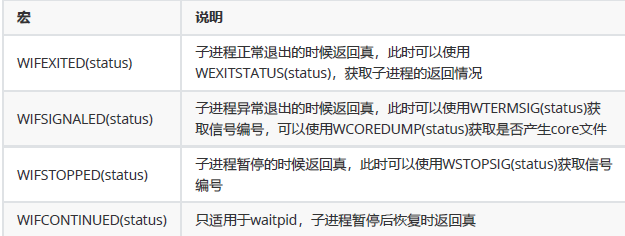

默认情况下， wait 和waitpid 都会使进程处于阻塞状态，也就是执行系统调用时，进程会中止运行。
如果给waitpid 的options参数设置一个名为WNOHANG的宏，则系统调用会变成非阻塞模式
当执行这个系统调用时，进程会立刻检查是否有子进程发送子进程终止信号，如果没有则系统调用立即返回。

非阻塞一般用来配合循环来使用。

# 9 进程的终止
在进程阶段，进程总共有5种终止方式，其中3种是正常终止，还有2种是异常终止。

|终止方式|终止情况|
| :----: | :----: |
|在main函数调用return |正常|
|调用exit函数|正常|
|调用_Exit函数或者_exit函数|正常|
|调用abort函数|异常|
|接受到能引起进程终止的信号|异常|

## 正常终止
1. main 中 return；
2. exit 函数
3. _Exit 函数和_exit 函数

exit 函数、_Exit 函数和_exit 函数可以立刻终止进程，无论当前进程正在执行什么函数。
tips:
exit会清空stdout。
如果在程序没有注意缓冲区，并且又使用了_exit 或者是_Exit 的话，很容易出现缓冲区内容丢失的情况。

## 异常终止
当进程处于前台的时候，按下ctrl+c 或者是ctrl+\ 可以给整个进程组发送键盘中断信号SIGINT和SIGQUIT。

1. 使用abort 可以主动调用异常终止。

2. 接受到能引起进程终止的信号

# 10 守护进程
大致上来说，所谓守护进程(daemon)，就是默默运行在后台的进程，也称作“后台服务进程”，通常守护进程的命名会以d结尾。

### 终端
终端是登录到Linux操作系统所需要的入口设备。

### 进程组
每个进程除了有一个进程ID以外，还属于一个进程组。

进程组是一个或者多个进程构成的集合。不同的进程组拥有不同的进程组ID，每个进程组有一个组长进程，组长的PID就是进程组ID。
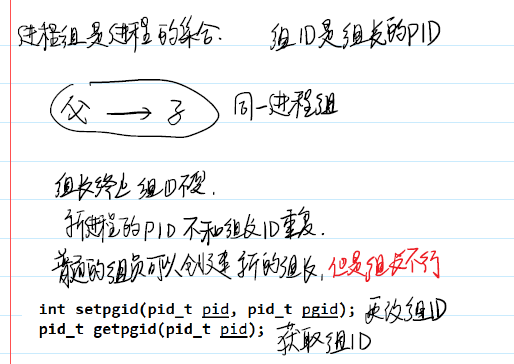

pid_t getpgid(pid_t pid);
//获取PID为pid的进程的进程组ID，如果pid为0，则获取本进程所属进程组ID

当使用shell运行程序创建进程的时候，被创建进程是shell的子进程，并且这个进程将会创建一个进程组，再使用fork 派生的进程都属于这个进程组。

setpgid 系统调用可以用来修改进程或者是exec 之前的子进程的进程组ID。

int setpgid(pid_t pid, pid_t pgid);
//将pid进程的进程组ID设置为pgid
//如果pid为0，使用调用者的进程ID
//如果pgid为0，则进程组ID和pid一致

### 会话 session
会话是一个或者多个进程组的集合
创建新会话的进程被称为新会话的会话首进程
会话首进程的PID就是会话ID

会话拥有一些特征：
- 一个会话可以有一个控制终端。
- 和控制终端建立连接的会话首进程被称为控制进程。-（通常登录时会自动连接，或者使用open 打开文件/dev/tty ）
- 一个会话存在最多一个前台进程组和多个后台进程组，如果会话和控制终端相连，则必定存在一个前台进程组。
- 从终端输入的中断，会将信号发送到前台进程组所有进程
- 终端断开连接，挂断信号会发送给控制进程

对于目前不是进程组组长的进程，可以使用系统调用setsid 可以新建一个会话。使用getsid 可以获取会话ID。
pid_t setsid(void);
pid_t getsid(pid_t pid);

### 守护进程的创建流程
* 父进程创建子进程，然后让父进程终止。
* 在子进程当中创建新会话。
* 修改当前工作目录为根目录，因为正在使用的目录是不能卸载的。
* 重设文件权限掩码为0，避免创建文件的权限受限。
* 关闭不需要的文件描述符，比如0、1、2。

### 守护进程和日志
使用守护进程经常可以用记录日志。操作系统的日志文件存储在/var/log/messages 中。

\#include <syslog.h>
void syslog(int priority, const char *format, ...);
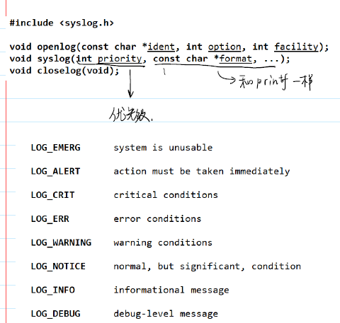

