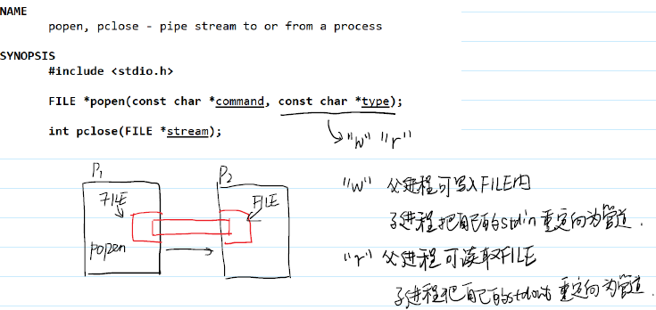
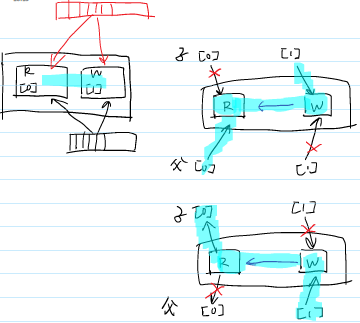
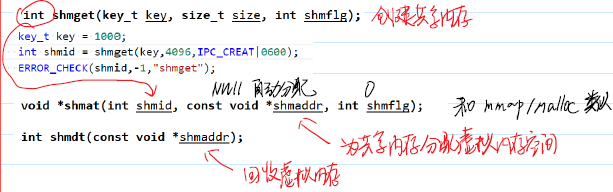
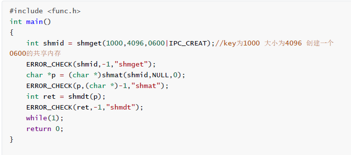
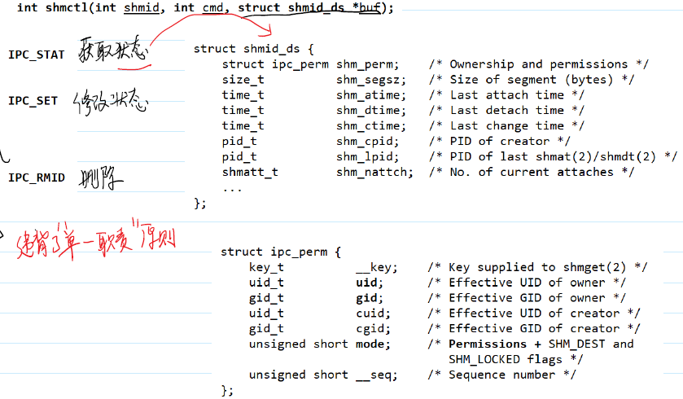
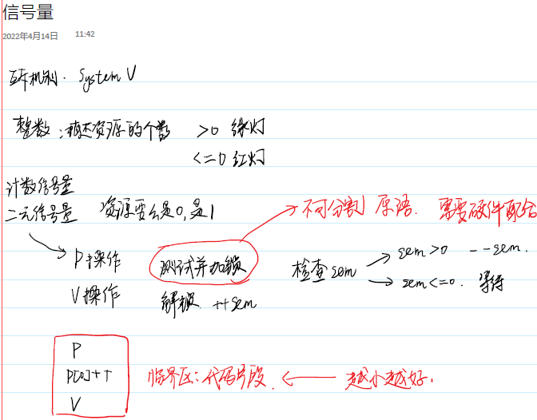
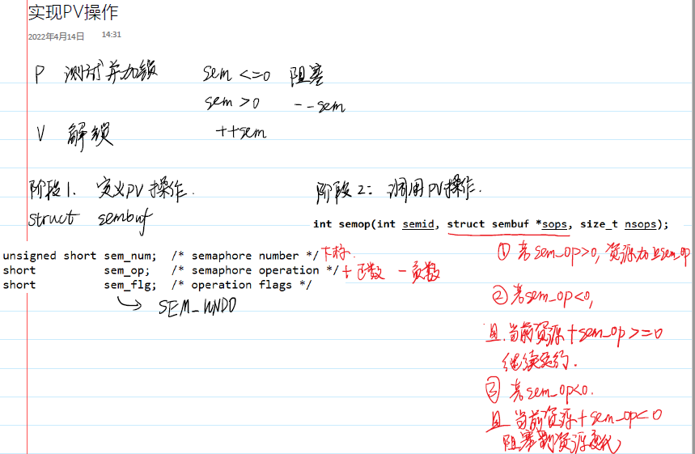
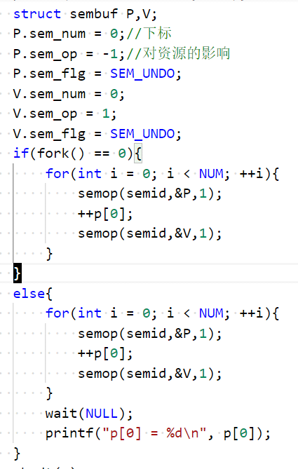
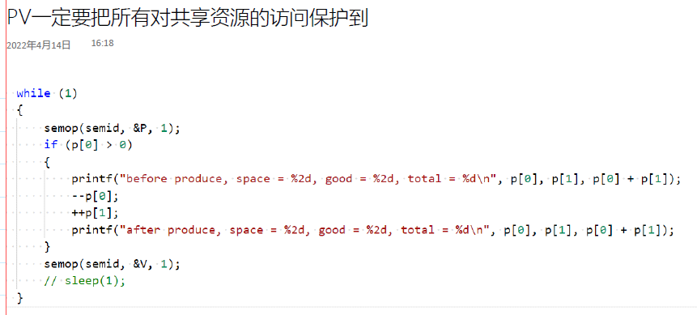
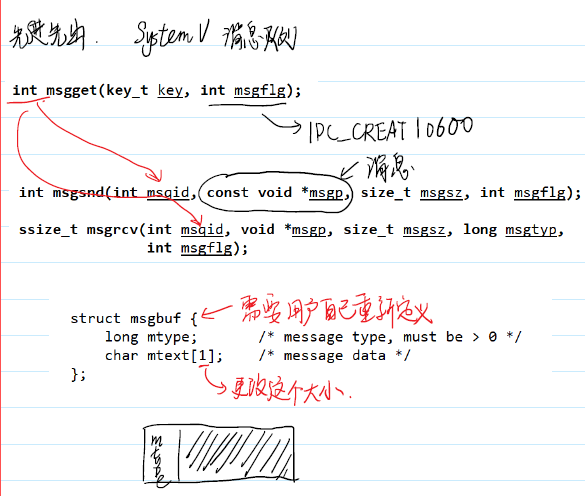

# IPC 进程间通信
虚拟CPU和虚拟内存的引入保证了进程的一个重要特性就是隔离，一个进程在执行过程中总是认为自己占用了所有的CPU和内存

# **管道**
有名管道：在文件系统中存在一个管道文件
匿名管道：在文件系统中不存在 - 只用于父子进程间

## popen
FILE *popen(const char *command, const char *type);

"w" 父进程可写入FILE，子进程把自己的stdin重定向为管道；
"r" 父进程可读取FILE，子进程把自己的stdout重定向为管道

int pclose(FILE *stream);

## pipe 系统调用
使用系统调用 pipe 可以创建匿名管道，为了支持可移植性，管道是半双工的，所以一般同时使用两条管道来实现全双工通信。

除此以外，管道只使用于存在亲缘关系的进程之间进行通信。通常而言，在一个进程中可以创建一个管道，然后再利用fork 就可以实现进程间通信了。

int pipe(int pipefd[2]);

使用pipe 之前，需要首先创建一个大小为2的整型数组，用于存储文件描述符
pipefd[0]是读端，pipefd[1]是写端

如果要实现父子进程之间全双工通信，需要调用pipe 两次来创建两条管道

## FIFO
使用mkfifo 可以创建管道文件，
int mkfifo(const char *pathname, mode_t mode);

使用unlink 则可以删除所有文件包括管道文件。
int unlink(const char *path);

移动/重命名文件，使用rename 接口即可
int rename(const char *oldpath, const char *newpath);

使用link 接口可以给文件建立硬连接。
int link(const char *oldpath, const char *newpath);

# 共享内存
## 使用共享内存原因
* 为了提升进程间通信的效率，共享内存（也有翻译成共享存储）的方式就诞生了。
共享内存是效率最高的IPC

* 共享内存就允许两个或者多个进程共享一个给定的物理存储区域。当然为了实现共享，内核会专门维护一个用来存储共享内存信息的数据结构，这用不同的进程就可以通过共享内存进行通信了。
> $lsof
使用lsof命令可以列出所有进程所打开的文件
可以发现非常多进程都使用C标准库文件

## System V 版本的共享内存
* 内核使用一个非负整数键（key）来区分不同的共享内存区域（或者是信号量或消息队列）。服务端进程和客户端进程可以使用同一个键来定位共享内存段进行通信
* 键可以手动指定，也可以使用接口ftok 生成。ftok 需要根据一个已存在的文件和一个项目ID（0～255的整数）来生成一个键。
key_t ftok(const char *pathname, int proj_id);

## 创建/获取共享内存
使用shmget 接口可以根据键来获取一个共享内存段。创建的共享内存段的所有字节会被初始化为0。
int shmget(key_t key, size_t size, int shmflg);
* key参数表示传入的键，可以是一个正数或者是宏IPC_PRIVATE。
* size表示共享内存的大小，其取值应当是页大小的整数倍。
* shmflg表示共享内存的属性，其最低9位表示各个用户对其的读/写/执行权限。
* shmget 的返回值表示共享内存段的描述符，以供后续使用。

使用shmat 接口根据一个指定描述来建立连接。
void *shmat(int shmid, const void *shmaddr, int shmflg);
* shmaddr参数一般设置为空指针，表示在堆空间中自动分配区域映射共享内存段
* shmflg表示权限（事实上这个权限是多余的），一般就是0。

## 使用共享内存进行进程间通信
共享内存可以在两个互不关联的进程之间进行通信，只需要彼此之间知道共享内存的键就好了。

## 两个进程同时对共享内存写入
共享内存可以实现多个进程同时对同一个数据进行访问和修改，这种并发的操作往往会造成预期外的错误。
这个多个进程同时写入造成结果出错误的情况被称为**竞态条件**。

## 解除共享内存映射
使用shmdt 可以解除堆空间到共享内存段的映射。具体的使用方法和free 差不多。

## 修改共享内存属性
使用shmctl 可以用于对共享内存段执行多种操作。根据cmd参数的不同，可以执行不同的操作：
- IPC_STAT可以用来获取存储共享内存段信息的数据结构；
- IPC_SET 可以用来修改共享内存段的所有者、所在组和权限;
- IPC_RMID 可以用来从内核删除共享内存段，当删除时，无论此时有多少进程映射到共享内存段，它都会被标记为待删除，一旦被标记以后，就无法再建立映射了。当最后一个映射解除时，共享内存段就真正被移除。

## 私有共享内存
使用shmget 接口时，如果参数key的取值是宏IPC_PRIVATE 。那么创建的共享内存段是私有的。
如果利用私有共享内存进行通信，那么进程之间必须存在亲缘关系。

## 虚拟地址和物理地址转换机制
### 地址分类
在x86架构中，地址分为3类：逻辑地址、线性地址和物理地址。
- 逻辑地址是使用在机器指令当中的地址，由段和偏移量组成。
- 线性地址就是虚拟地址，是代码中所使用的地址。
- 物理地址是内存芯片中用于访问物理内存的地址，是最底层的地址。

### 硬件分页机制
分页单元的主要作用就是把虚拟地址转换成物理地址。
虚拟地址空间和物理内存都被分成固定长度的页（常见的页大小是4096字节）。
在一个虚拟页中，虚拟地址是连续的，其映射的物理地址也是连续的（物理页，也叫页框）。在内核访问内存时，每次访问都是以一页为单位的。

### Linux的页管理
对于每个用户进程，它都拥有自己独立的页目录表和页表集合，这样不同进程的相同虚拟地址对应的物理地址就是不一样的。

### 再探写时复制
当父进程使用fork 创建了一个子进程以后，操作系统需要为子进程拷贝一份父进程的页表到内存当中。
当子进程的某个可以写入的页被第一次写入的时候，内核会意识到对应的物理页是属于父进程的，此时会为子进程分配一个新的物理页。
如果要分配的物理页不在主存储器中，此时会触发一个异常名为缺页异常，当异常处理完成以后，子进程会被分配一个新的物理页，并且物理页内容会是原来页的拷贝。

# 信号量

int semget(key_t key, int nsems, int semflg);
* nsems参数表示集合中总共有多少个信号量值
* shmflg表示共享内存的属性

int semctl(int semid, int semnum, int cmd, ...);
* semid：信号量的标识符，就是semget 的返回值
* semnum：某个信号量值在信号量集合中的索引（范围从0开始）
* cmd参数表示要执行的操作：
IPC_STAT表示要获取信号量状态
IPC_SET表示要设置信号量状态，可变参数要设置为状态结构体的指针
IPC_RMID表示要删除信号量，不需要设置可变参数，注意和共享内存的删除不同，信号量是立即删除的
GETVAL表示获取置某个信号量值
SETVAL表示设置某个信号量值，可变参数传入数值

使用semop 配合恰当的参数可以实现P操作和V操作。
int semop(int semid, struct sembuf *sops, size_t nsops);
* semid：信号量的标识符
* sops：描述操作的结构体，sem_num成员表示信号量值的索引，sem_op表示信号量数值的变化，sem_flg表示一些其他控制信息。

信号量在操作系统的查看信息ipcs 和手动删除ipcrm 的操作和共享内存是一致的。

## 使用信号量保护共享资源

## 信号量的性能
使用函数gettimeofday 可以较为精确地统计消耗的时间。
int gettimeofday(struct timeval *tv, struct timezone *tz);

## semget注意事项
使用接口semget 创建信号量集合的时候，如果不是采用私有的方式创建信号量集合，那么多个进程传入同一个key来重复使用semget 时，必须是不能修改信号量集合的大小的。

## GETVAL
在接口semctl 中，cmd参数如果传入的是GETVAL，那么就可以用来获取信号量的 值

## SETALL和GETALL
使用SETALL参数可以对信号量集合中的所有信号量值进行初始化。首先需要先创建一个元素类型为unsigned short的数组，数组中的值是各个信号量值的初始值。

## 生产者 消费者问题
生产者消费者问题是最经典的进程间通信问题之一。这个问题是这样的，存在一个仓库的格子上限为N，每个格子可以存储一个商品，消费者可以从仓库中取出商品，生产者可以放入商品，但是执行的过程中，商品数量不能为负数，也不能超过N个。

使用信号量的方法解决这个问题有两个思路。
一种是采用一个二元信号量，在取出和放入商品前先根据当前商品数量来设置信号量数值，从而确定此操作是否可以进行。
另一种方法使用采用计数信号量，将商品个数和剩余格子的个数都设为信号量，然后使用信号量集合来管理这两个信号量值。

## 不使用SEM_UNDO的后果 死锁
处于加锁状态的进程异常终止了 - 死锁

如果不使用SEM_UNDO，处于加锁状态的代码依然有可能会触发报错导致进程终止，并且信号量的数值并不会恢复，导致死锁。

而使用SEM_UNDO的时候，如果进程在加锁状态下终止，那么信号量的数值会直接根据加锁次数回退，并且最小值为0。

# 消息队列
广义的消息队列指的是一种用于在多个进程（通常是跨机器的）之间的通信机制。

这里所描述的是狭义的消息队列，它是一种进程间通信的手段，只适用于在本地的多进程进行通信。

区别于管道的流式结构，消息队列最显著的特点就是它维持一个消息的链表，并且可以使用先进先出的方式来进行取出消息。除此以外，消息队列使用的时候不需要先打开读端写端，可以直接往其中写入数据。

- msgget 可以用来创建一个消息队列。
int msgget(key_t key, int msgflg);
- msgsnd 将新消息加入到队列末尾
int msgsnd(int msqid, const void *msgp, size_t msgsz, int msgflg);
msgp：指向一个消息数据，它的长度应当小于系统规定的上限，第一个成员必须是长整型表示消息类型。这个结构体类型必须要重新声明。
msgsz：消息中mtext数组的大小。
flag：的值可以设置为IPC_NOWAIT表示非阻塞方式发送数据。

- msgrcv 可以用来读取消息
ssize_t msgrcv(int msqid, void *msgp, size_t msgsz, long msgtyp,int msgflg);
msgtyp：可以用指定要读取的数据的类型，类型匹配的消息会按先进先出的方式取出，如果该参数为0，则会无视类型取出第一个消息。

# proc目录
Linux系统上的/proc目录是一种文件系统，即proc文件系统。
/proc是一种伪文件系统（也即虚拟文件系统），存储的是当前内核运行状态的一系列特殊文件。
用户可以通过这些文件查看有关系统硬件及当前正在运行进程的信息，甚至可以通过更改其中某些文件来改变内核的运行状态。
