# 信号
# 1 信号的概念
信号：一种软件层面的异步事件机制
信号是进程在运行过程中，由自身产生或由进程外部发过来的消息（也称为事件）。

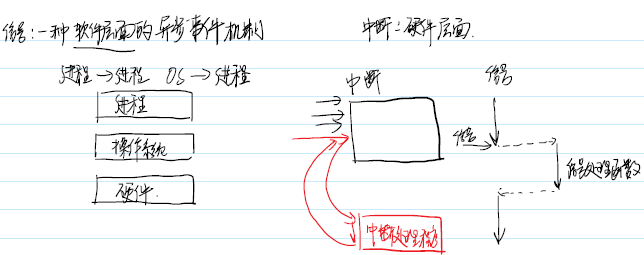

信号是硬件中断的软件模拟，是一种软中断。每个信号用一个整型常量宏表示，以 SIG 开头，比如 SIGCHLD、SIGINT等。

> kill -l
> man 7 signal

# 2 信号的产生
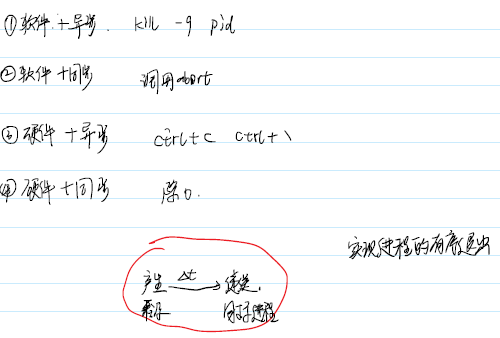
产生信号的方法有很多种：
* 用户按下ctrl+c 可以产生一个SIGINT中断信号
* 进程出现除0、访问异常的内存位置时会触发信号，这种信号往往是由硬件检测得到并产生的
* 用户使用kill 命令，或者进程调用kill 系统调用也可以产生信号，这种产生信号方式对用户的身份有所限制
* 进程也会收到由于软件检测得到并产生信号，比如网络传输异常SIGURG、管道异常SIGPIPE和时钟异常SIGALRM

# 3 信号的处理
进程接收到信号以后，可以有如下 3 种选择进行处理：
* 接受默认处理：进程接收信号后以默认的方式处理。

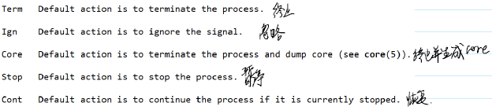

* 忽略信号：通过代码，显示地忽略某个信号的处理。

* 捕捉信号并处理：进程可以事先注册信号处理函数

有两个信号既不能被忽略也不能被捕捉，它们是 SIGKILL 和 SIGSTOP。即进程接收到这两个信号后，只能接受系统的默认处理，即终止进程。SIGSTOP 是暂停进程。

# 4 Linux中所有信号
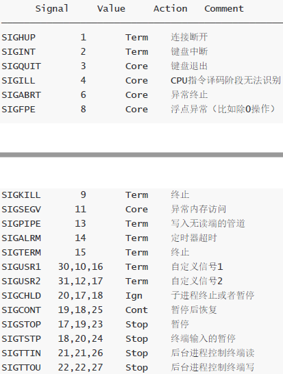

# 5 信号的实现机制
信号的生成来自内核，对应了task_struct 的sigpending成员，表示待处理信号的集合
当一个进程处于一个可以接受信号状态的时候（响应时机），它会从sigpending中取得信号，并执行默认行为、忽略或者是自定义信号处理函数。
信号的实现可以分为两个阶段：信号产生、信号递送。
已经产生但是还没有传递的信号被称为挂起信号（pending signal）或者是未决信号。如果信号一直处于未决状态，那么就称进程阻塞了信号传递。
由进程的某个操作产生的信号称为同步信号
外部事件产生的信号叫做异步信号

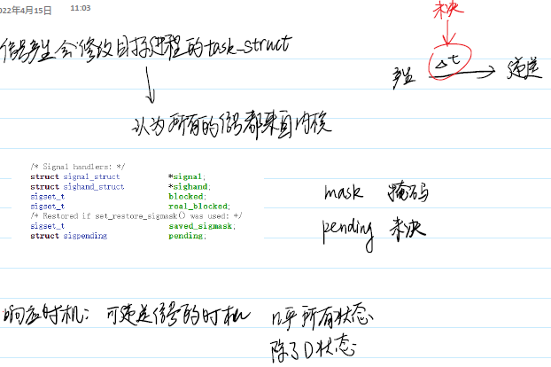

# 6 函数 signal 注册信号
signal 函数可以用来捕获信号并且指定对应的信号处理行为。
typedef void (*sighandler_t)(int);
sighandler_t signal(int signum, sighandler_t handler);
* signum：要捕捉的信号
* 第二个参数是函数指针，表示捕获信号后执行的函数

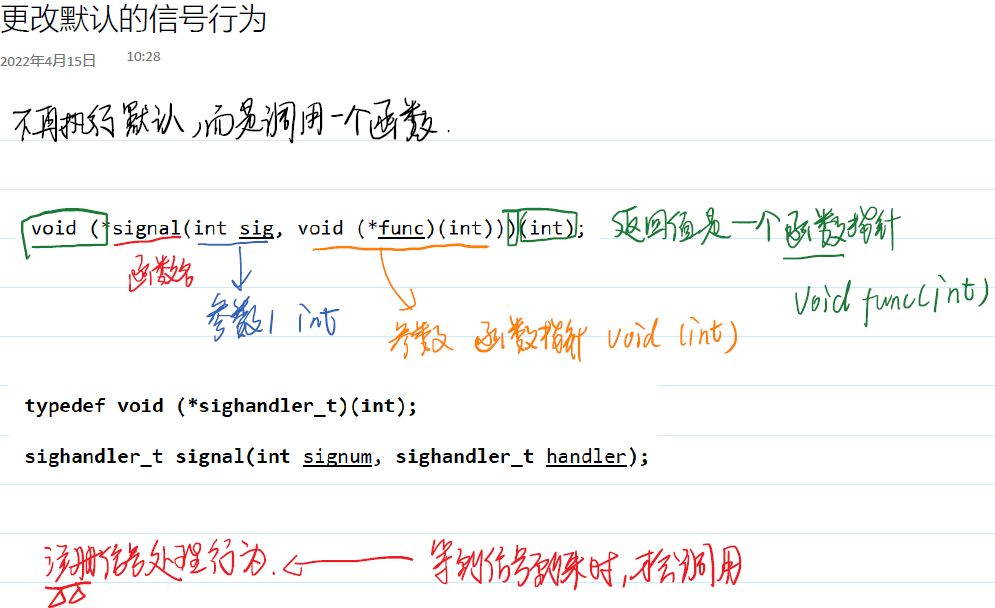

# 7 注册多个信号
使用signal 函数是可以同时注册多个信号的。
```c
    ret = signal(SIGINT, sigFunc);
    ret = signal(SIGQUIT, sigFunc);
```

# 8 内核不可中断状态
处于内核不可中断状态的进程无法接受并处理信号。内核不可中断状态是进程等待态的一种形式。

# 9 多个信号处理同时执行
在使用函数signal 时，如果进程收到一个信号，自然地就会进入信号处理的流程，如果在信号处理的过程中：
* 接受到另一个不同类型信号。当前流程会被中断，先执行新信号流程，再恢复原来信号处理流程。
* 接受到另一个相同类型信号。当前流程不会被中断，继续原来的信号流程，执行完毕以后再响应新来到的信号。
* 如果接受到了连续重复的相同类型的信号，后面重复的信号会被忽略，从而该信号 处理流程只能再多执行一次。

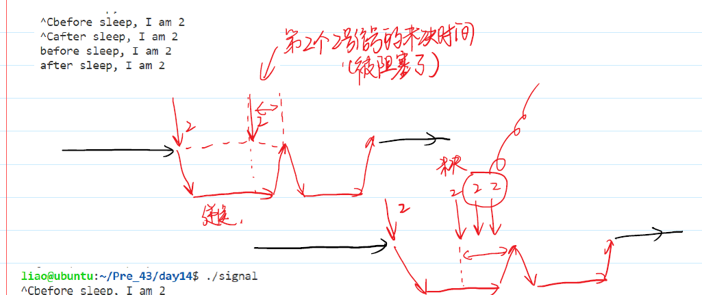

* 内核里面，某个进程的所有挂起信号使用一个位图进行管理的。
当进程处于某个信号处理流程的时候，如果再产生一个同类型信号，信号处理流程不会中断，而信号屏蔽字中的对应位会设置为1，表示此时存在一个挂起信号，随后产生的同类型信号将不再被记录。

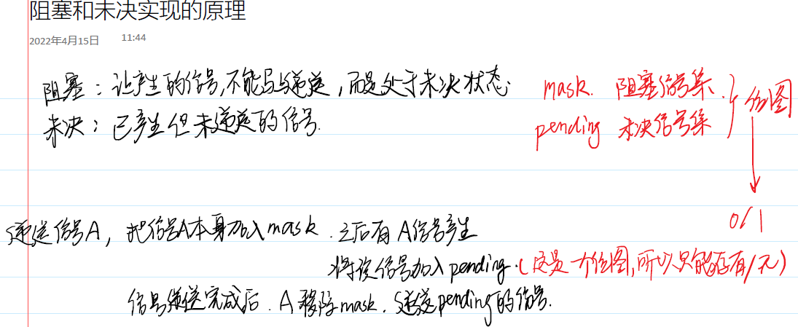

# 10 重新注册信号处理流程
如果希望在进程执行过程中重新指定信号的处理流程，可以多次使用signal 函数。
```c
signal(SIGINT, SIG_IGN);
printf("proces begin!\n");
sleep(10);
printf("sleep over!\n");
signal(SIGINT, SIG_DFL);
```

# 11 函数 sigaction注册信号
int sigaction(int signum, const struct sigaction *act, struct sigaction
*oldact);
* sa_handler成员或者sa_sigaction成员是用来描述信号处理的回调函数。
* sa_flags参数表示信号处理方式掩码，可以用来设置信号的处理模式。
* sa_mask描述了一个信号集，调用回调函数以前，该信号集要加入进程的信号屏蔽字中，回调函数返回的时候再恢复原来的信号屏蔽字，除此以外，正在处理的信号默认是被阻塞的。
* sa_restorer成员暂时无用。


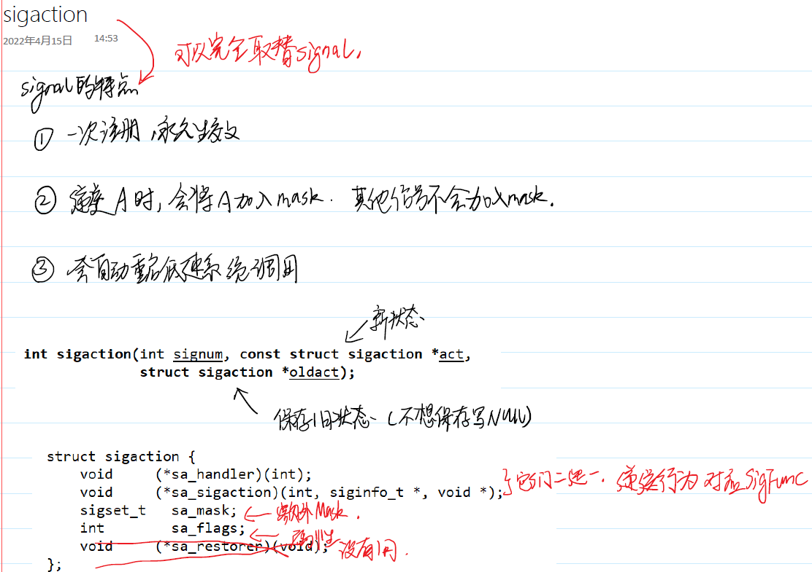

## sa_flags的取值集合
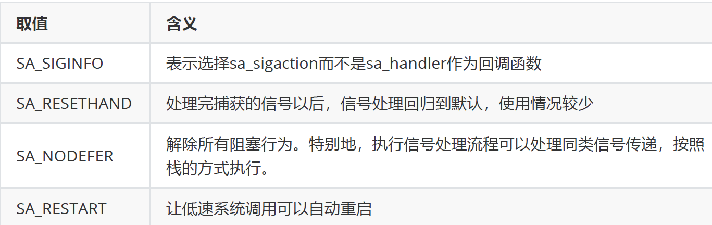

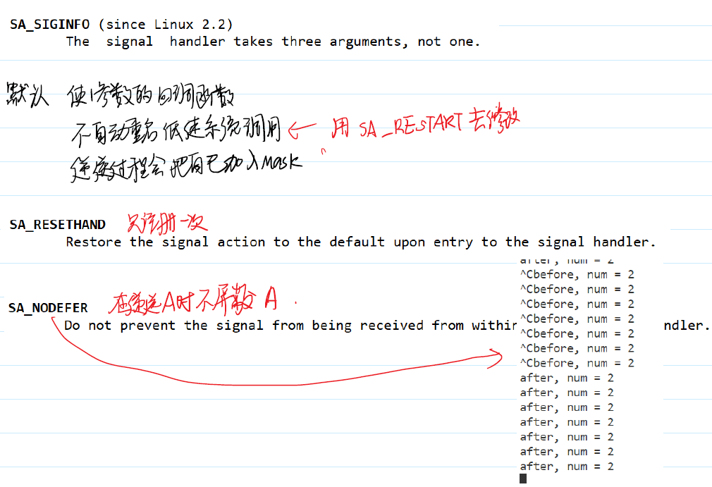

## sa_mask设置阻塞集合
可以使用sa_mask参数来增加一些信号的阻
塞操作。

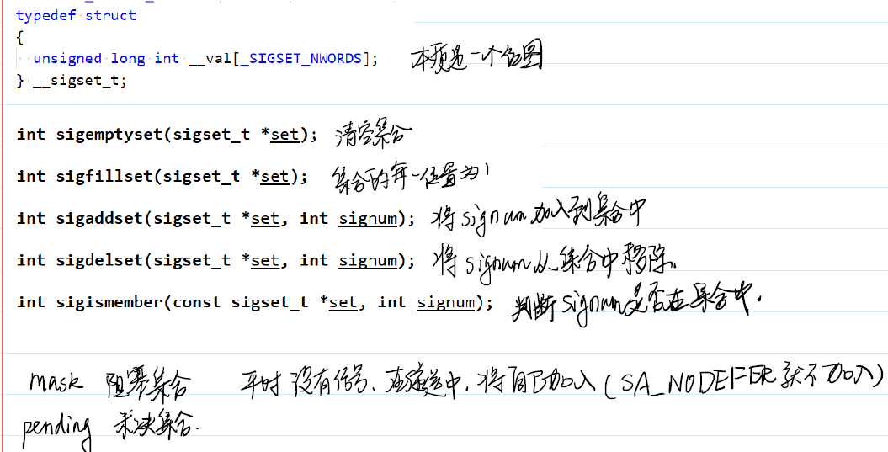

# 12 系统调用 sigpending
使用系统调用sigpending 可以获取当前所有未决信号（已经产生没有递送的信号）的集合。

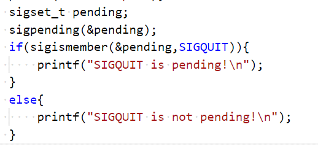

# 13 sigprocmask 实现全程阻塞
使用系统调用sigprocmask 可以实现全程阻塞的效果。它可以检测或者更改信号屏蔽字的内容。参数how描述了如何修改；参数set指向了信号集；如果oldset非空时，则会返回当前信号屏蔽字。
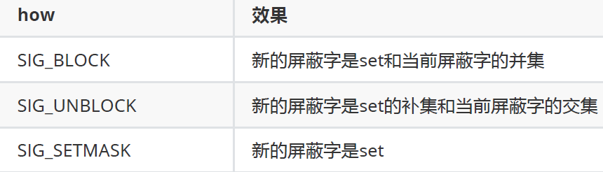

int sigprocmask(int how, const sigset_t *set, sigset_t *oldset);

# 14 kill 系统调用
系统调用kill 可以用来给另一个进程发送信号。
int kill(pid_t pid, int sig);
* pid：进程ID
* sig：信号数值

# 15 pause 和 sigsuspend
pause 系统调用可以用来阻塞一个进程，直到某个信号被递送时，进程会解除阻塞，然后终止进程或者执行信号处理函数。

# 16 sleep 和系统时间
系统调用alarm 可以用来实现延时信号，原理是设置一个定时器。超时递送一个SIGALRM信号
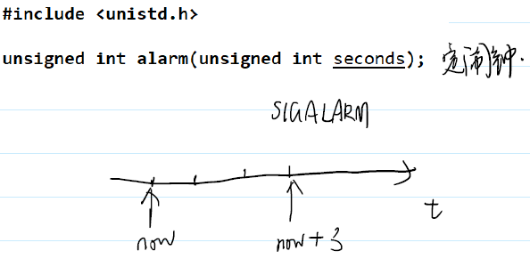
利用alarm 系统调用和pause 系统调用，我们可以比较简陋地实现sleep 功能

# 17 时钟处理
setitimer 系统调用负责调整间隔定时器。间隔定时器在创建的时候，会设置一个时间间隔，定时器到达时间间隔时，调用进程会产生一个信号，随后定时器被重置。

操作系统为每个进程维护3种不同的定时器，分别是真实计时器、虚拟计时器和实用计时器。
* ITIMER_REAL：真实时间，产生SIGALRM信号。
* ITIMER_VIRTUAL：用户态模式下的CPU时间，产生SIGVTALRM信号。
* ITIMER_PROF：用户态以及内核态模式下的CPU时间，产生SIGPROF信号。


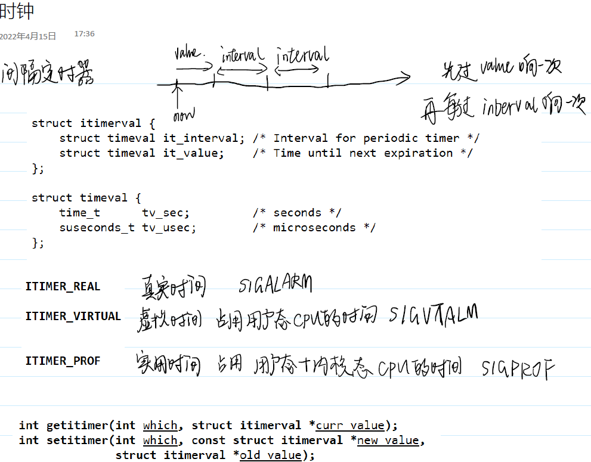
# 小项目 四窗口聊天