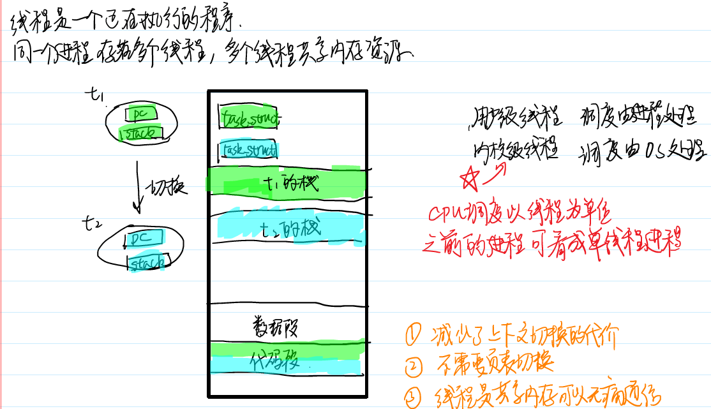
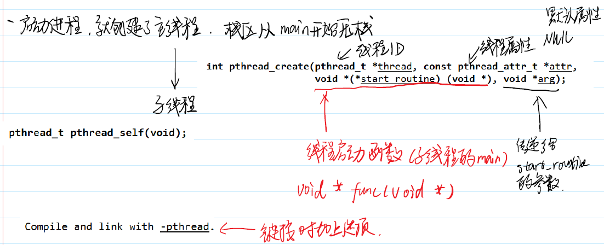

# 线程
# 1 从进程到线程
进程是正在执行的程序，并且是系统资源分配的基本单位。
计算机花费了大量的时间在切换不同的进程上面。
当一个进程在执行过程中，CPU的寄存器当中需要保存一些必要的信息，比如堆栈、代码段等，这些状态称作上下文。
为了缩小切换进程的开销，线程的概念便诞生了。线程又被称为轻量级进程。
线程就取代进程成为CPU时间片的分配和调度的最小单位，在Linux操作系统当中，每个线程都拥有自己独立的task_struct 结构体。
属于同一个进程的多个线程会共享进程地址空间，每个线程在执行过程会在地址空间中有自己独立的栈，而堆、数据段、代码段、文件描述符和信号屏蔽字等资源则是共享的。

# 2 线程的创建和终止
常用的线程库函数和之前的进程的对应关系。
pthread_create 创建一个线程  fork
pthread_exit  线程退出  exit
pthread_join  等待线程结束并回收资源  wait
pthread_self  获取线程id  getpid

注：在使用线程相关的函数之后，在链接时需要加上-lpthread 选项

## 2.1 线程函数的错误处理

## 2.2 创建线程
线程创建使用的函数是 pthread_create
int pthread_create(pthread_t *thread, const pthread_attr_t *attr,void *(*start_routine) (void *), void *arg);
* 创建者需要分配空间去存储一个线程id，并且将其地址传入
* attr 参数可以用来指定创建出来的线程的属性. NULL - 默认
* start_routine 是一个函数指针类型的参数。地位相当于主线程的 main ,作为线程执行的入口函数。
* arg 是传递给start_routine 的参数。

不同线程都拥有自己独立唯一的线程id（thread id）,使用函数 pthread_self 可以获取本线程的id。

# 3 线程的取消和资源清理

# 4 线程的同步和互斥

# 5 线程的属性

# 6 线程安全与可重入性