# 1 Linux入门 
## 1.1 概述
Linux由林纳斯.托瓦兹发明。是一套免费试用和自由传播的类**Unix**操作系统。   
知名发行版：Ubantu、RedHat、CenOS、Debian、SuSE

## 1.2 Linux、Windows区别
|比较|Windows|Linux|
|:---:|:---:|:---:|
|收费|收费且贵|免费或少许收费|
|软件与支持|数量和质量优势|免费质量欠缺|
|安全性|补丁，一般|相对更安全|
|使用习惯|图形交互|图形和命令交互|
|可定制性|封闭|开源|
|应用场景|桌面系统|服务器|

---

## 2 VM、Linux
### 2.1 VMware
在物理机上创建虚拟机的软件
### 2.2 CentOS
Linux一个发行版本

---

## 3 Linux文件与目录结构
### 3.1 Linux文件
Linux系统中“一切皆文件”
### 3.2 Linux目录结构
* /bin
Binary缩写，存放着最经常使用的指令
* /home
存放普通用户的主目录，在Linux中每个用户都有一个自己的目录，一般以用户账号命名
* /root
系统管理员，超级权限者用户主目录
* /etc
所有系统管理所需的配置文件和子目录
* /usr
重要，用户许多程序文件在此
* /boot
存放启动Linux时使用的核心文件
* /media
设备
* /mnt
临时挂载
* /opt
额外安装软件所摆放的目录
* /var
不断扩充的东西，经常修改的目录

---

## 5 网络配置
- ifconfig 
显示所有网络接口的配置信息
- ping 目的主机
测试当前服务器是否可以连接目的主机
- hostname
查看当前服务器的主机名称

---

## 6 系统管理
### 6.1 Linux中进程和服务
计算机中，一个正在执行的程序或命令，被叫做“进程”（process）。  
启动之后一只存在、常驻内存的进程，一般被称作“服务”（service）。

CentOS 7 版本  
systemctl  
基本语法  
systemctl  start | stop | restart | status  服务名  
查看服务  
/user/lib/systemd/system
### 6.2 系统运行级别
CentOS 7 运行级别简化：  
multi-user.target 等价于原运行级别3（多用户有网，无图形界面）  
graphical.target 等价于原运行级别5（多用户有网，有图形界面）  

查看当前运行级别:  
systemctl get-default
### 关机重启命令
1 sync       （功能描述：将数据由内存同步到硬盘中）  
2 halt         （功能描述：停机，关闭系统，但不断电）  
3 poweroff （功能描述：关机，断电）  
4 reboot     （功能描述：就是重启，等同于shutdown -r now）  
5 shutdown [选项] 时间
> -H    相当于 halt 停机
> -r	相当于 reboot 重启
> now   立刻关机
> 时间  等待多久后关机（单位分钟）

---

# **Linux系统编程**

## 看帮助手册
2号 系统调用
3号 库函数

步骤：
1. 看名字
2. 看声明
    1）头文件
    2）指针类型的参数
    传入参数：有const,内存是主调函数分配，可传递字符串字面值常量
    传入传出参数：无const,内存是主调函数分配，栈 堆 数据段 -&取地址传递给被调函数
    3）指针类型的返回值
    这个返回值不可能指向被调函数栈帧内的数据
    可能指向 主调函数栈帧、堆空间、数据段
    4）返回值和报错的关系
3. 细节描述 - 按需查看

重概念
进程：正在执行的程序
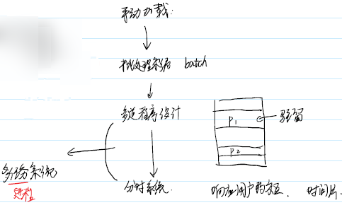
### 缺陷
- 多道程序设计
1.缺乏隔离
2.内存利用率低
3.地址使用麻烦，只能使用相对地址

利用虚拟内存 用户- 虚拟内存 - 内存
每个进程在逻辑有自己独立的内存空间

- 分时系统的缺陷
用户主动要主动放弃CPU

用户 - 虚拟CPU - CPU
让用户觉得自己是 CPU 的独占者
在某一时刻，多个进程同时进行 - 并行
在某一段时间，多个进程同时进行 - 并发

### 虚拟内存的实现
**局部性原理**
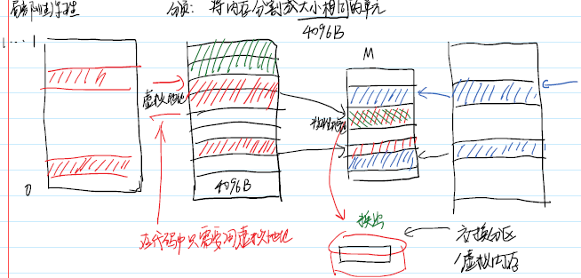

### 进程的切换
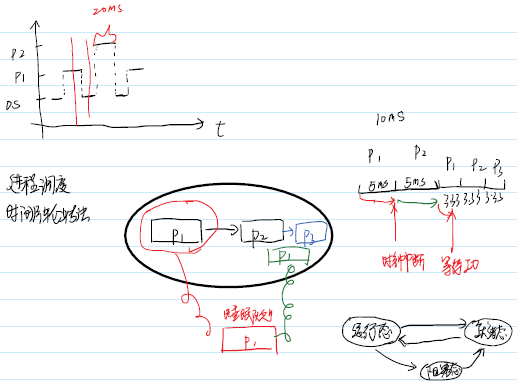
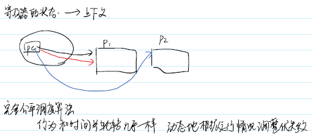

### 进程的概念
用户角度看，进程是正在进行的程序
操作系统来看，进程是资源（cpu和内存）分配的基本单元

### 操作系统怎么样管理进程
进程：任务
教科书 - PCB 进程控制块
Linux -  task_struct 任务描述符 任务队列
task_struct 描述了进程的一切信息

### pid
pid是一个正整数，给用户来标识不同的进程。唯一的正整数标识符
在linux中进程存在亲缘关系

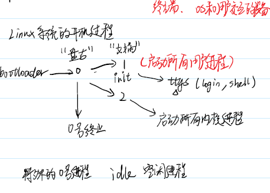

### 获取 pid
pid_t getpid(void);
pid_t grtppid(void);

同一个程序可对应多个进程

### 进程的权限
文件的权限 r w x {u,g,o}
进程权限取决于进程有什么样的身份

uid_t getuid(void); - 真实身份
uid_t geteuid(void); - 有效身份

user有可执行程序的 x 权限，通过该程序启动一个进程，进程的uid 和 euid 都是user

12位权限
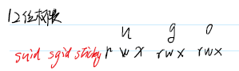

#### suid权限
针对可执行程序 - 动态权限
① u 的 x 和 o 的 x 必须存在
② u 的 s 存在(suid)

O用户通过该执行程序启动的进程 euid更改为程序的拥有者

#### sgid权限
针对可执行程序 - 动态权限
① g 的 x 和 o 的 x 必须存在
② g 的 s 存在(sgid)

O用户通过该执行程序启动的进程 egid更改为程序的拥有组

#### sticky 粘滞位
针对目录文件
对于 o 用户，拥有 w 和 t（sticky） 权限
o 用户可以新建文件 可以删除自己的文件 不能删除别人的文件

### 进程相关的命令
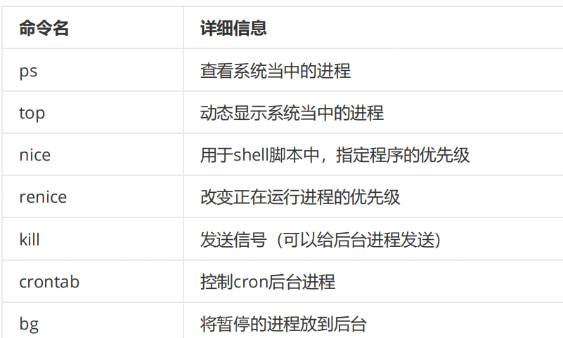

#### ps-elf
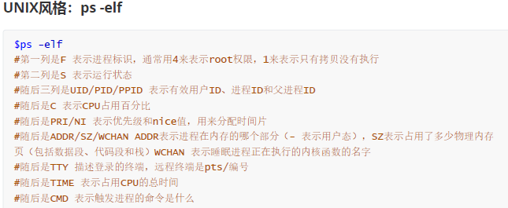

#### ps aux
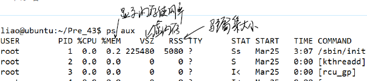

free 看内存
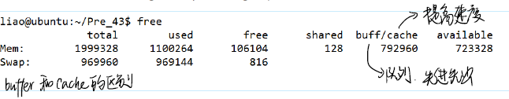

#### top
获取实时的进程状态

buffers与cached区别：
buffers指的是块设备的读写缓冲区
cached指的是文件系统本身的页面缓存。
他们都是Linux系统底层的机制，为了加速对磁盘的访问。

#### 优先级系统
Linux的优先级总共的范围有140，对于ubuntu操作系统而言，其范围是-40到99，优先级的数值越低，表示其优先级越高。

Linux中拥有两种类型的调度策略，分别是实时调度策略和普通调度策略。

nice值可以用来调整优先级，
其范围为-20～19。其中正数表示降低权限，负数表示提升权限。

使用nice命令和renice命令可以用来调整nice值。
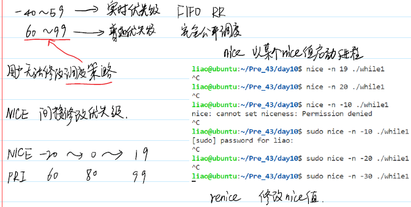

#### 前台和后台
前台 可以响应键盘中断的进程
ctrl+c 表示终止信号， ctrl+z 表示暂停信号 
后台 不可以响应
当进程处于后台的时候，只能通过kill 命令发送信号给它。

使用shell启动进程的时候如果在末尾加上& 符号可以用来直接运行后台进程。

使用ctrl+z 可以暂停当前运行的前台进程，并将其放入后台。它也会输出一个任务编号到屏幕上。

使用jobs 命令可以查看和管理所有的后台任务，使用fg 命令可以将后台进程拿到前台来。使用bg 命令可以将后台暂停的程序运行起来。
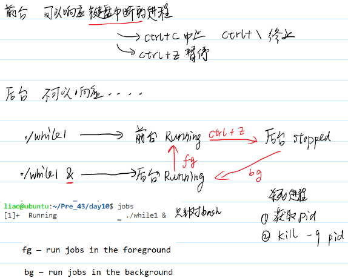

#### crontab 定时任务
crontab 可以实现定期执行任务
使用crontab -e 然后选择合适的文本编辑器。或者直接用root权限打开/etc/crontab 文件

每项任务拥有六个字段，分别表示
分钟（0～60）、小时（0～23）、日期（1～31）、月份（1～12）、周（0～7 0和7都代表周日）和要执行的命令。如果是修改文件，还需要在执行命令的前面添加用户名。
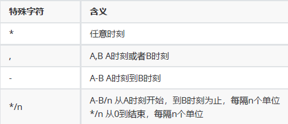

