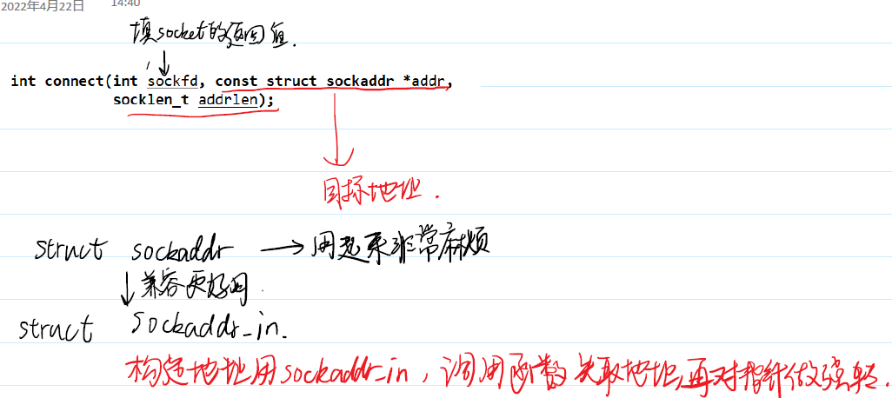

# 网络编程

# 1 Berkeley Socket
TCP/IP协议族标准只规定了网络各个层次的设计和规范，具体实现则需要由各个操作系统厂商完成。
socket 即套接字是指网络中一种用来建立连接、网络通信的设备，用户创建了socket 之后，可以通过其发起或者接受TCP 连接、可以向TCP 的发送和接收缓冲区当中读写TCP数据段，或者发送UDP 文本。

# 2 地址信息设置
用户一般先使用struct sockaddr_in 来构造地址，再将其进行强制类型转换成struct sockaddr 以作为网络接口的参数。

```C
struct sockaddr_in {
    sa_family_t sin_family;
    in_port_t sin_port; 
    struct in_addr sin_addr; 
};

struct in_addr {
    uint32_t s_addr; 
};
```


## 大小端转换
TCP/IP协议规定，当数据在网络中传输的时候，一律使用网络字节序即大端法。
接收方和发送方都是主机字节序即小端法。

* 下面是整数大小端转换相关的函数。
```c
uint32_t htonl(uint32_t hostlong);
uint16_t htons(uint16_t hostshort);
uint32_t ntohl(uint32_t netlong);
uint16_t ntohs(uint16_t netshort);
//h - host 主机; n - net 网络; s - short 2B; l - int 4B
```

* 下面是32位网络字节序IP地址和点分十进制的IP地址互相转换的函数


```C
#include <myself.h>
int main(int argc, char *argv[]) {
    // ./addr 192.168.14.9 1234
    ARGS_CHECK(argc,3);
    struct sockaddr_in addr;
    addr.sin_family = AF_INET;
    addr.sin_port = htons(atoi(argv[2]));
    addr.sin_addr.s_addr = inet_addr(argv[1]);
    printf("port = %x\n", addr.sin_port);
    printf("ip = %08x\n", addr.sin_addr.s_addr);
}
```

## 域名和IP地址的对应关系
人类需要一个方便记忆的域名，去建立域名和IP地址的映射关系。
一种方法是修改本机的 hosts文件/etc/osts 
但是更加通用的方案是利用DNS协议，去访问一个DNS服务器，服务器当中存储了域名和IP地址的映射关系。

与这个操作相关的函数是gethostbyname ，下面是其用法：
```c
//从代码中获取域名对应的IP地址
#include <netdb.h>
struct hostent *gethostbyname(const char *name);
    struct hostent {
    char *h_name; 
    char **h_aliases; 
    int h_addrtype; 
    int h_length; 
    char **h_addr_list; 
}
```

```c
//获取远程主机的信息
#include <myself.h>
int main(int argc, char *argv[]) {
    // ./gethostbyname www.baidu.com
    ARGS_CHECK(argc,2);
    struct hostent *pHost = gethostbyname(argv[1]);
    if(pHost == NULL) {
        fprintf(stderr,"gethostbyname:%s\n", strerror(h_errno));
    }
    printf("Host real name = %s\n", pHost->h_name);
    for(int i = 0;pHost->h_aliases[i] != NULL; ++i) {
        printf("    alias name = %s\n", pHost->h_aliases[i]);
    }
    printf("addrtype = %d\n", pHost->h_addrtype);
    printf("addrlength = %d\n", pHost->h_length);
    for(int i = 0; pHost->h_addr_list[i] != NULL; ++i) {
        char buf[1024] = {0};
        inet_ntop(pHost->h_addrtype, pHost->h_addr_list[i], buf, sizeof(buf));
        printf("    addr = %s\n", buf);
    }
}
```

# 3 TCP 通信


## socket
socket 函数用于创建一个socket 设备。调用该函数时需要指定通信的协议域、套接字类型和协议类型。
socket 函数的返回值是一个非负整数，就是指向内核socket 设备的文件描述符。
```c
#include <sys/socket.h>
int socket(int domain, int type, int protocol);
//domain AF_INET --> IPv4 AF_INET6 --> IPv6
//type SOCK_STREAM --> TCP SOCK_DGRAM --> UDP
//protocol IPPROTO_TCP --> TCP IPPROTO_UDP -->UDP
```
```c
int main() {
    int socketFd = socket(AF_INET,SOCK_STREAM,0);
    //创建一个socket 支持IPv4 和 TCP
    ERROR_CHECK(socketFd,-1,"socket");
    printf("socketFd = %d\n", socketFd);
    close(socketFd);
}
```

## connect
客户端使用connect 来建立和TCP服务端的连接。

int connect(int sockfd, const struct sockaddr *addr, socklen_t addrlen);



```c
int main(int argc, char *argv[]) {
    // ./connect 192.16.14.9 1234
    ARGS_CHECK(argc,3);
    int socketFd = socket(AF_INET,SOCK_STREAM,0);
    //创建一个socket 支持IPv4 和 TCP
    ERROR_CHECK(socketFd,-1,"socket");
    printf("socketFd = %d\n", socketFd);
    struct sockaddr_in addr; //创建用 sockaddr_in
    addr.sin_family = AF_INET;
    addr.sin_port = htons(atoi(argv[2]));
    addr.sin_addr.s_addr = inet_addr(argv[1]);
    //调用函数时，先去地址再强转
    int ret = connect(socketFd,(struct sockaddr *)&addr,sizeof(addr));
    ERROR_CHECK(ret,-1,"connect");
    close(socketFd);
}
```
使用tcpdump 命令可以查看包的状态。


## bind
bind 函数用于给套接字赋予一个本地协议地址（即IP地址加端口号）。

int bind(int sockfd, const struct sockaddr *addr,socklen_t addrlen);

## listen
使TCP服务端开启监听。服务端在开启了listen 之后，就可以开始接受客户端连接了。

int listen(int sockfd, int backlog);

一旦启用listen 后，操作系统就知道该套接字是服务端的套接字，操作系统内核就不再启用其发送和接收缓冲区，转而在内核区维护两个队列结构：半连接队列和全连接队列。
半连接队列:管理成功第一次握手的连接
全连接队列:管理已经完成三次握手的队列。


## DDOS攻击
伪造一些SYN请求但是并不打算建立连接，服务端内核就会维持一个很大的队列来管理这些半连接。当半连接足够多的时候，就会导致新来的正常连接请求得不到响应， 也就是所谓的DDOS攻击。

一般的防御措施就是就是减小SYN+ACK重传次数、增加半连接队列长度、启用syn cookie。
更有效的防御手段是激活tcp_syncookies——在连接真正创建起来之前，它并不会立刻给请求分配数据区存储连接状态，而是通过构建一个带签名的序号来屏蔽伪造请求。

## accept
accept 函数由服务端调用，用于从全连接队列中取出下一个已经完成的TCP连接。
如果全连接队列为空，那么accept 会陷入阻塞。一旦全连接队列中到来新的连接，accept 操作就会就绪，这种就绪是读操作就绪，所以可以使用select 函数的读集合进行监听。

当accept 执行完之后，内核会创建一个新的套接字文件对象，该文件对象的文件描述符是accept 的返回值，文件对象当中最重要的结构是一个发送缓冲区和接收缓冲区，可以用于服务端通过TCP连接发送和接收TCP段。

旧的管理连接队列的套接字称作监听套接字，新的用于发送和接收TCP段的称作已连接套接字。

int accept(int sockfd, struct sockaddr *addr, socklen_t *addrlen);


```c
int main(int argc, char *argv[]) {
    // ./connect 192.168.227.131 1234
    ARGS_CHECK(argc,3);
    int sockFd = socket(AF_INET,SOCK_STREAM,0);
    //创建一个socket 支持IPv4 和 TCP
    ERROR_CHECK(sockFd,-1,"socket");
    printf("sockFd = %d\n", sockFd);
    struct sockaddr_in addr; //创建用 sockaddr_in
    addr.sin_family = AF_INET;
    addr.sin_port = htons(atoi(argv[2]));
    addr.sin_addr.s_addr = inet_addr(argv[1]);
    //调用函数时，先去地址再强转
    //对于bind而言 addr一定是本地地址
    int ret = bind(sockFd,(struct sockaddr *)&addr,sizeof(addr));
    ERROR_CHECK(ret,-1,"bind");
    ret = listen(sockFd,10);
    ERROR_CHECK(ret,-1,"listen");
    struct sockaddr_in cilentAddr;
    socklen_t cilentAddrLen = sizeof(cilentAddr);
    int netFd = accept(sockFd,(struct sockaddr *)&cilentAddr,&cilentAddrLen);
    ERROR_CHECK(netFd,-1,"accept");
    printf("netFd = %d\n", netFd);
    close(sockFd);
}
```
客户端使用close 关闭套接字或者服务端使用close 关闭已连接套接字的时候就是主动发起断开连接四次挥手的过程。

## send 和 recv
send 和recv 用于将数据在用户态空间和内核态的缓冲区之间进行传输，无论是客户端还是服务端均可
使用，但是只能用于TCP连接。
将数据拷贝到内核态并不意味着会马上传输，而是会根据时机再由内核协议栈按照协议的规范进行分节

ssize_t send(int sockfd, const void *buf, size_t len, int flags);
ssize_t recv(int sockfd, void *buf, size_t len, int flags);
使用read 和write 可以实现同样的效果，相当于flags 参数为0。


需要特别注意的是， send 和recv 的次数和网络上传输的TCP段的数量没有关系，多次的send 和recv可能只需要一次TCP段的传输。
另外一方面，TCP是一种流式的通信协议，消息是以字节流的方式在信道中传输，这就意味着一个重要的事情，消息和消息之间是没有边界的。

## 使用 select 实现 TCP 即时聊天


```c
//cilent
int main(int argc, char *argv[]) {
    // ./cilent 192.168.227.131 1234
    ARGS_CHECK(argc,3);
    int sockFd = socket(AF_INET,SOCK_STREAM,0);
    ERROR_CHECK(sockFd,-1,"socket");
    struct sockaddr_in addr;
    addr.sin_family = AF_INET;
    addr.sin_port = htons(atoi(argv[2]));
    addr.sin_addr.s_addr = inet_addr(argv[1]);
    int ret = connect(sockFd,(struct sockaddr *)&addr,sizeof(addr));
    ERROR_CHECK(ret,-1,"connect");
    
    fd_set rdset;
    char buf[4096] = {0};
    while(1) {
        FD_ZERO(&rdset);
        FD_SET(STDIN_FILENO,&rdset);
        FD_SET(sockFd,&rdset);
        select(sockFd + 1,&rdset,NULL,NULL,NULL);
        if(FD_ISSET(STDIN_FILENO,&rdset)) {
            bzero(buf,sizeof(buf));
            ret = read(STDIN_FILENO,buf,sizeof(buf));
            if(ret == 0) {
                send(sockFd,"nishigehaoren",13,0);
                break;
            }
            send(sockFd,buf,strlen(buf),0);
        }
        if(FD_ISSET(sockFd,&rdset)) {
            bzero(buf,sizeof(buf));
            ret = recv(sockFd,buf,sizeof(buf),0);
            if(ret == 0) {
                puts("chat is end!");
                break;
            }
            puts(buf);
        }
    }
    close(sockFd);
}
```
```c
//server
int main(int argc, char *argv[]) {
    // ./server 192.168.227.131 1234
    ARGS_CHECK(argc,3);
    int sockFd = socket(AF_INET,SOCK_STREAM,0);
    ERROR_CHECK(sockFd,-1,"socket");
    int optval = 1;
    int ret = setsockopt(sockFd,SOL_SOCKET,SO_REUSEADDR,&optval,sizeof(int));
    ERROR_CHECK(ret,-1,"setsockopt");
    struct sockaddr_in addr;
    addr.sin_family = AF_INET;
    addr.sin_port = htons(atoi(argv[2]));
    addr.sin_addr.s_addr = inet_addr(argv[1]);
    ret = bind(sockFd,(struct sockaddr *)&addr,sizeof(addr));
    ERROR_CHECK(ret,-1,"bind");
    ret = listen(sockFd,10);
    ERROR_CHECK(ret,-1,"listen");
    int netFd = accept(sockFd,NULL,NULL);
    ERROR_CHECK(netFd,-1,"accept");

    fd_set rdset;
    char buf[4096] = {0};
    while(1) {
        FD_ZERO(&rdset);
        FD_SET(STDIN_FILENO,&rdset);
        FD_SET(netFd,&rdset);
        select(netFd + 1,&rdset,NULL,NULL,NULL);
        if(FD_ISSET(STDIN_FILENO,&rdset)) {
            bzero(buf,sizeof(buf));
            ret = read(STDIN_FILENO,buf,sizeof(buf));
            if(ret == 0) {
                send(netFd,"nishigehaoren",13,0);
                break;
            }
            send(netFd,buf,strlen(buf),0);
        }
        if(FD_ISSET(netFd,&rdset)) {
            bzero(buf,sizeof(buf));
            ret = recv(netFd,buf,sizeof(buf),0);
            if(ret == 0) {
                puts("chat is end!");
                break;
            }
            puts(buf);
        }
    }
    close(sockFd);
    close(netFd);
}
```

## TIME_WAIT 和 setsockopt
如果是服务端主动调用close 断开的连接，即服务端是四次挥手的主动关闭方，由之前的TCP状态转换图可知，主动关闭方在最后会处于一个固定2MSL时长的TIME_WAIT等待时间。在此状态期间，如果尝试使用bind 系统调用对重复的地址进行绑定操作，那么会报错。

用户可以选择使用setsockopt 函数修改监听套接字的属性，使其可以在TIME_WAIT状态下依然可以bind 重复的地址（需要在bind 之前执行）。

int setsockopt(int sockfd, int level, int optname,const void *optval, socklen_t optlen);


## select 监听 socket 支持断开重连
accept 会造成阻塞。实际上服务端可以使用select 管理监听套接字，检查其全连接队列是否存在已经建好的连接，如果存在连接，那么其读事件即accept 操作便就绪

* 每次重新调用select 之前需要提前准备好要监听的文件描述符，这些文件描述符当中可能会包括新的已连接套接字的文件描述符。
* select 的第一个参数应当足够大，从而避免无法监听到新的已连接套接字的文件描述符（它们的数值可能会比较大）。
* 需要处理accept 就绪的情况。

采用上面的调整之后，服务端就可以支持客户端断开重连了。

```c
// accept要放在select之后
    // 使用时确保从标准输入中输入数据在客户端建立连接后
    // accept之后创建新的netFd,这个netFd加入监听--->分离监听和就绪
    // 客户端如果断开连接以后，服务端不要退出，要取消监听netFd

    fd_set rdset; //单纯保存就绪的fd
    fd_set monitorSet;//使用一个单独的监听集合
    FD_ZERO(&monitorSet);
    FD_SET(STDIN_FILENO,&monitorSet);
    FD_SET(sockFd,&monitorSet);
    char buf[4096] = {0};
    int netFd = -1;
    while(1) {
        memcpy(&rdset,&monitorSet,sizeof(fd_set));
        select(20,&rdset,NULL,NULL,NULL);
        if(FD_ISSET(STDIN_FILENO,&rdset)) {
            bzero(buf,sizeof(buf));
            ret = read(STDIN_FILENO,buf,sizeof(buf));
            if(ret == 0) {
                send(netFd,"nishigehaoren",13,0);
                break;
            }
            send(netFd,buf,strlen(buf),0);
        }
        if(FD_ISSET(sockFd,&rdset)) {
            netFd = accept(sockFd,NULL,NULL);
            ERROR_CHECK(netFd,-1,"accept");
            FD_SET(netFd,&monitorSet);
            puts("new connect is accepted!");
        }
        if(FD_ISSET(netFd,&rdset)) {
            bzero(buf,sizeof(buf));
            ret = recv(netFd,buf,sizeof(buf),0);
            if(ret == 0) {
                puts("bye bye");
                FD_CLR(netFd,&monitorSet);
                close(netFd);
                netFd = -1;
                continue;
            }
            puts(buf);
        }
    }
    close(sockFd);
    close(netFd);
```


# 4 UDP 通信


## sendto 和 recvfrom
这两个函数的行为类似于send 和recv ，不过会有一些额外的参数，用来指定或者保存对端的套接字地址结构以及对应的大小。

```c
ssize_t sendto(int sockfd, const void *buf, size_t len, int flags,const struct sockaddr *dest_addr, socklen_t addrlen);
ssize_t recvfrom(int sockfd, void *buf, size_t len, int flags,struct sockaddr *src_addr, socklen_t *addrlen);
```

在使用UDP进行的通信的时候，要特别注意的是这是一个无连接的协议。
* 调用socket 函数的时候需要设置SOCK_DGRAM 选项
* 必须由客户端先调用sendto 发送消息给服务端
* select 之前先recvfrom

UDP是一种保留消息边界的协议，无论用户态空间分配的空间是否足够 recvfrom 总是会取出一个完整 UDP报文，那么没有拷贝的用户态内存的数据会直接丢弃。

> 主机A向主机B发送数据，以TCP方式发送3个包，对方可能会收到几个包？答：任意个
> 以UDP方式发送3个包，对方可能会收到几个包？答：至多3个

## 使用 UDP 即时聊天
UDP是无连接协议，客户端需要先发送一个消息让服务端知道客户端的地址信息，然后再使用select 监听网络读缓冲区和标准输入即可。

```c
#include <myself.h>
int main(int argc, char *argv[]) {
    // ./client_chat 192.168.227.131 1234
    ARGS_CHECK(argc,3);
    int sockFd = socket(AF_INET,SOCK_DGRAM,0);
    ERROR_CHECK(sockFd,-1,"socket");
    struct sockaddr_in addr;
    addr.sin_family = AF_INET;
    addr.sin_port = htons(atoi(argv[2]));
    addr.sin_addr.s_addr = inet_addr(argv[1]);
    int ret = sendto(sockFd,"chat begin",10,0,(struct sockaddr *)&addr,sizeof(addr));
    ERROR_CHECK(ret,-1,"sendto");
    char buf[4096] = {0};
    fd_set rdset;
    while(1) {
        FD_ZERO(&rdset);
        FD_SET(STDIN_FILENO,&rdset);
        FD_SET(sockFd,&rdset);
        select(sockFd + 1,&rdset,NULL,NULL,NULL);
        if(FD_ISSET(STDIN_FILENO,&rdset)) {
            bzero(buf,sizeof(buf));
            int ret = read(STDIN_FILENO,buf,sizeof(buf));
            if(ret == 0) {
                sendto(sockFd,buf,0,0,(struct sockadd *)&addr,sizeof(addr));
                break;
            }
            sendto(sockFd,buf,strlen(buf),0,(struct sockadd *)&addr,sizeof(addr));
        }
        if(FD_ISSET(sockFd,&rdset)) {
            bzero(buf,sizeof(buf));
            socklen_t addrLen = sizeof(addr);
            int ret = recvfrom(sockFd,buf,sizeof(buf),0,(struct sockaddr *)&addr,&addrLen);
            if(ret == 0) {
                break;
            }
            puts(buf);
        }
    }
    close(sockFd);
}
```

# 5 epoll 系统调用
select 的缺陷

## epoll 的基本原理
和select 一样， epoll 也是一种IO多路复用机制，它可以监听多个设备的就绪状态，让进程或者线程只在有事件发生之后再执行真正的读写操作。
epoll 可以在内核态空间当中维持两个数据结构：监听事件集合和就绪事件队列。
。监听事件集合通常是一个红黑树，就绪事件队列是一个线性表。


## 使用 epoll 取代 select

## 使用 epoll 关闭长期不发消息的连接

## 非阻塞读操作

## epoll 的边缘触发

# 6 socket 属性调整


# 7 recv 和 send 的标志  