# 1 进程池和线程池的设计思路
一个良好的架构需要满足许多侧面的要求，其中最基本的要求是可维护性和性能
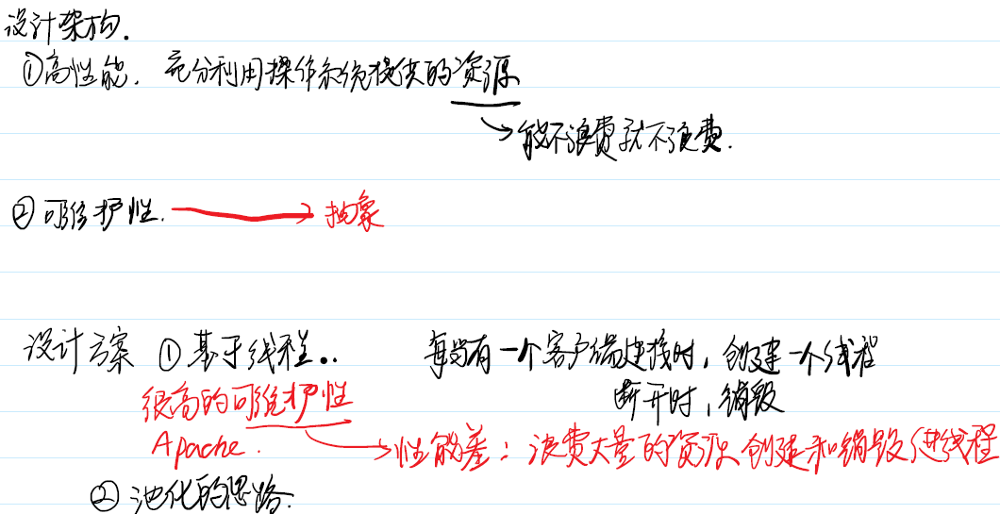

池化的思路
申请了资源之后，用完毕不要马上回收，可以交给另外的事情复用
进程池/线程池设计思路：
1. 提前创建好若干进程
2. 每当有任务到来分配一个进程
3. 任务完成后归还进程
4. 整个进程池关闭的时候再销毁

问题
任务太多 -> 任务队列
事件 -> IO多路复用
事件驱动模型 event-driven

# 2 进程池的实现
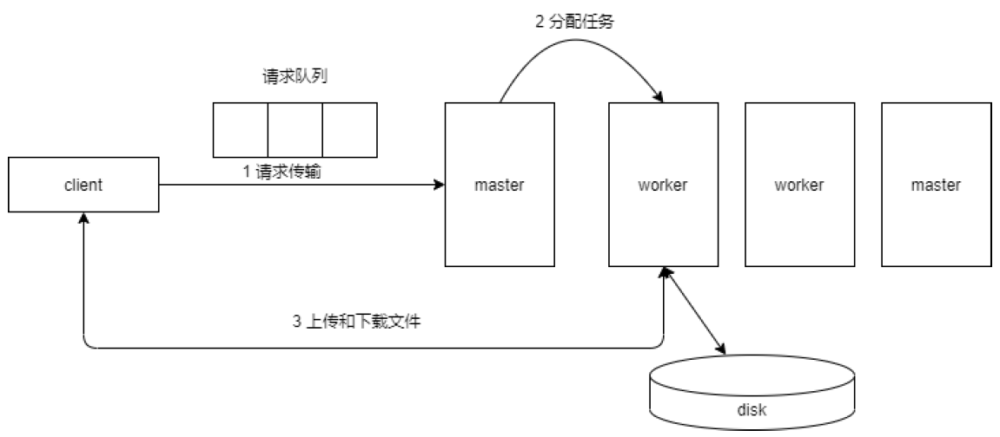

## 2.1 父子进程创建
首先，我们先实现最基本的功能，使用一个父进程创建若干个子进程。

## 2.2 父进程处理网络连接
在创建完所有的子进程之后，父进程的下一个工作目标是准备接受客户端的TCP连接，这个工作和之前网络编程时的工作内容差不多，按照socket 、bind 和listen 的顺序执行系统调用即可。

## 2.3 本地套接字
父进程和子进程的地址空间是隔离的，如果两个进程之间需要进行通信，那就要选择一种合适的进程间通信的手段。
使用系统调用socketpair 可以在父子进程间利用socket 创建一个全双工的管道。除此以外，本地套接字可以在同一个操作系统的两个进程之间传递文件描述符。

int socketpair(int domain, int type, int protocol, int sv[2]);
* domain 必须填写AF_LOCAL。
* type 可以选择流式数据还是消息数据
* protocol 一般填0表示不需要任何额外的协议
* sv 这个参数和pipe 的参数一样，是一个长度为2的整型数据，用来存储管道两端的文件描述符（值得注意的是， sv[0] 和sv[1] 没有任何的区别）。

一般socketpair 之后会配合fork 函数一起使用，从而实现父子进程之间的通信。

## 2.4 父子进程共享文件描述符
除了传递一般的控制信息和文本信息（比如上传）以外，需要特别注意的是需要传递已连接套接字的文件描述符。
父进程会监听特定某个IP:PORT ，如果有某个客户端连接之后，子进程需要能够连上accept 得到的已连接套接字的文件描述符，这样子进程才能和客户端进行通信。这种文件描述符的传递不是简单地传输一个整型数字就行了，而是需要让父子进程共享一个套接字文件对象。
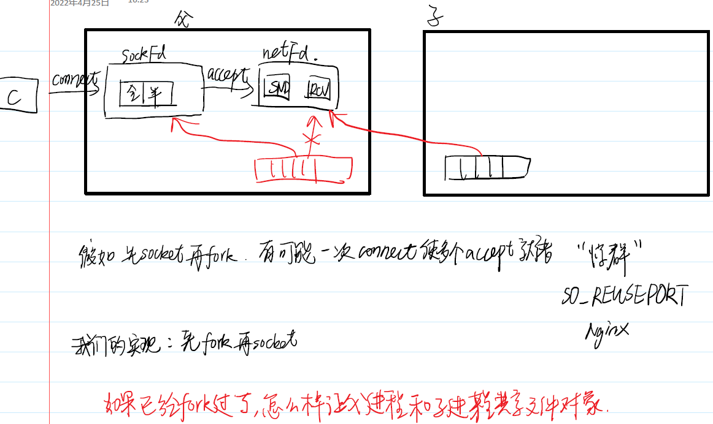

ssize_t sendmsg(int sockfd, const struct msghdr *msg, int flags);
ssize_t recvmsg(int sockfd, struct msghdr *msg, int flags);
使用sendmsg 和recvmsg 的时候附加一个消息头部，即一个struct msghdr 类型的结构体。
首先，需要将要传递的内容存储入msg_iov 当中，在这里需要注意的是，元素类型为struct iovec 的数组可以存储一组离散的消息，只需要将每个消息的起始地址和本消息的长度存入数组元素中即可。
接下来，需要将文件描述符的信息存入控制字段msg_control 中，这个我们需要存储一个地址值，该地址指向了一个struct cmsghdr 类型的控制信息。
为了传递文件描述符，需要将结构体中的cmsg_level 字段设置为SOL_SOCKET ，而 cmsg_type 字段需要设置为SCM_RIGHTS ，再将数据部分设置为文件描述符。这样，该文件描述符所指的文件对象就可以传递到另一个进程了。

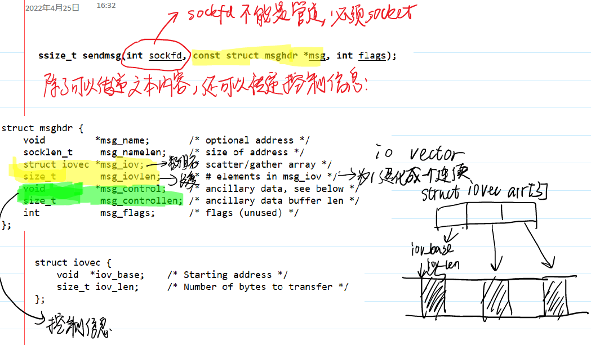

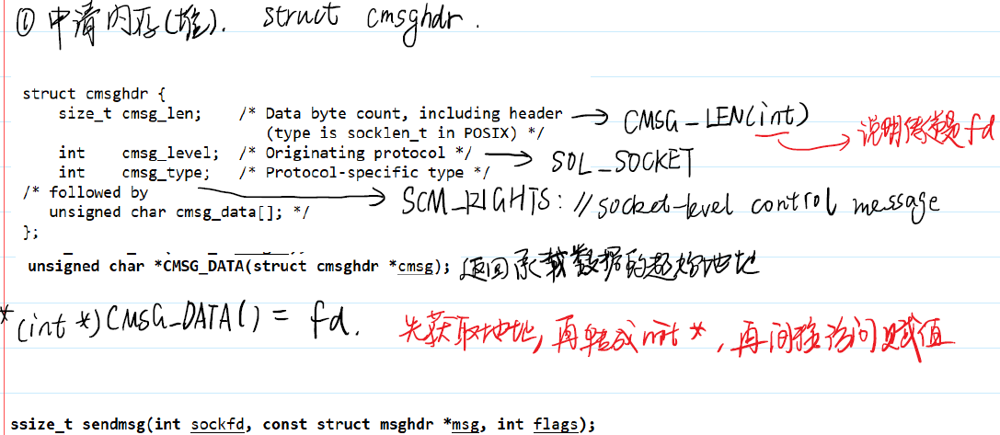

总结：

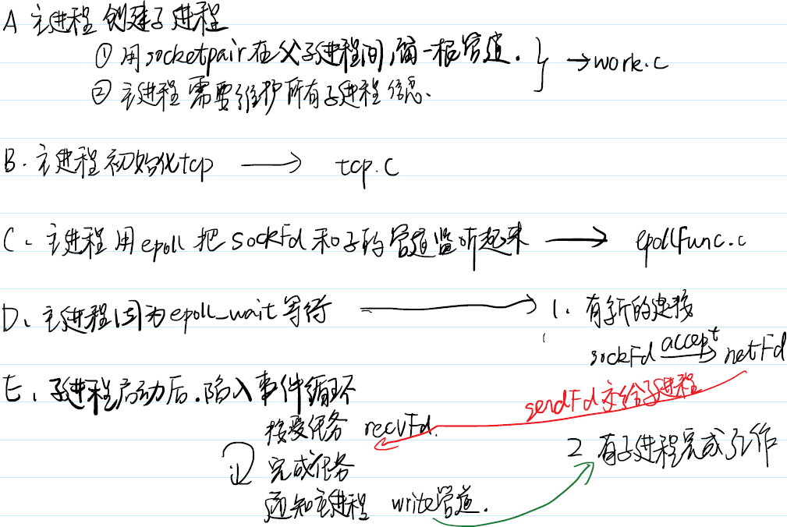

# 3 文件的传输
文件传输的本质和cp 命令的原理一样：应用程序需要打开源文件并且进行读取，然后将读取得到的内容写入到目标文件当中。
如果是远程上传/下载文件，则需要将前述流程分解成两个应用程序，应用程序之间使用网络传输数据。

## 3.1 小文件传输和小火车
所谓的小文件，就是指单次send 和recv 就能发送/接收完成的文件。
要发送两个部分的数据：其一是文件名，用于对端创建文件；另一个部分是文件内容。

问题：TCP是一种字节流协议，消息无边界。
接收方无法区分文件名和文件内容。完全可能会出现把文件名和文件内容混杂在一起的情况，这种就是江湖中所谓的"粘包"问题。

接下要要做的是在应用层上构建一个私有协议，这个协议的目的是规定TCP发送和接收的实际长度从而确定单个消息的边界。

目前这个协议非常简单，可以把它看成是一个小火车，包括一个火车头和一个火车车厢。火车头里面存储一个整型数字，描述了火车车厢的长度，而火车车厢才是真正承载数据的部分。
```c
typedef struct train_s{
    int size;
    char buf[1000];
} train_t;
```
## 3.2 大文件传输
最自然的思路解决大文件问题就是使用循环机制：发送方使用一个循环来读取文件内容，每当读取一定字节的数据之后，将这些数据的大小和内容填充进小火车当中；接收方就不断的使用recv 接收小火车的火车头和车厢，先读取4个字节的火车头，再根据车厢长度接收后续内容。

一旦文件增大，会出现问题，而且还是不稳定出现问题：
* 最基本的问题发送的文件和接收到的文件大小不一致。
* 另外一个问题就是服务端可能会出现死循环。

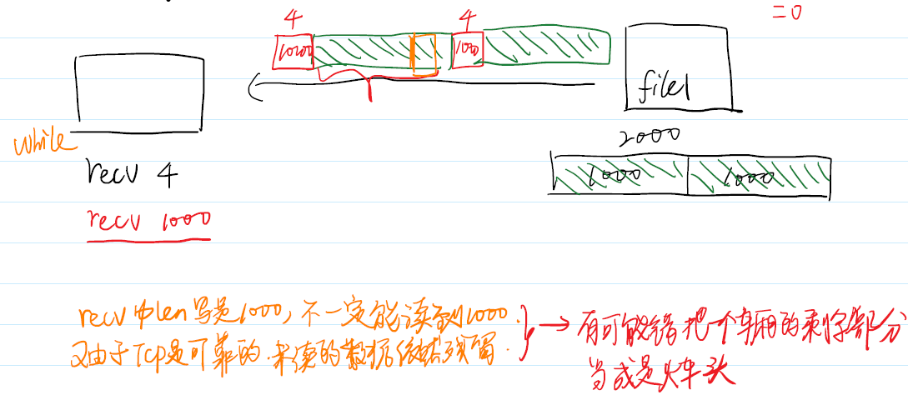

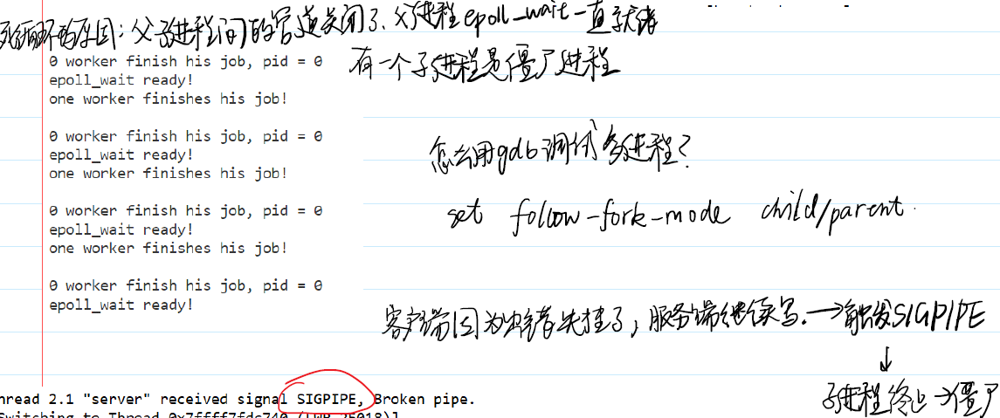

## 3.3 忽略SIGPIPE信号
首先来解决死循环的问题，这个死循环的表现是服务端的epoll_wait 总是有文件描述符处于就绪状态，这个就绪的文件描述符就是工作进程的管道。
通过ps -elf 命令可以查看所有进程的状态，会发现该工作进程处于“僵尸”状态，“僵尸”状态出现的原因是该工作
进程终止但是父进程并未回收资源。
进入探查后，我们发现进程终止的原因是收到了信号SIGPIPE ，产生这个信号的原因是服务端往已经关闭的网络socket中写入数据了。
解决这个问题有两种方案，一种是使用signal 或者sigaction 忽略这个信号；另一种是给send 的最后一个参数加上MSG_NOSIGNAL 选项，这样进程也可以忽略信号。

```c
send(netFd,p,fileSize,MSG_NOSIGNAL);
```

## 3.4 让recv取出所有数据
另一个问题是传递数据和实际数据不一致的问题。
根源是调用recv 的时候，需要传入一个整型参数，但这个长度参数描述的是最大的长度，而实际recv 的长度可能并没有达到最大的长度。
因为TCP是一种流式协议，它只能负责每个报文可靠有序地发送和接收，但是并不能保证传输到网络缓冲区当中的就是完整的一个小火车。这样就有可能会到导致数据读取问题。
一种解决方案就是给recv 函数设置MSG_WAITALL 属性，这样的话， recv 在不遇到EOF或者异常关闭的情况就能一定把最大长度数据读取出来。

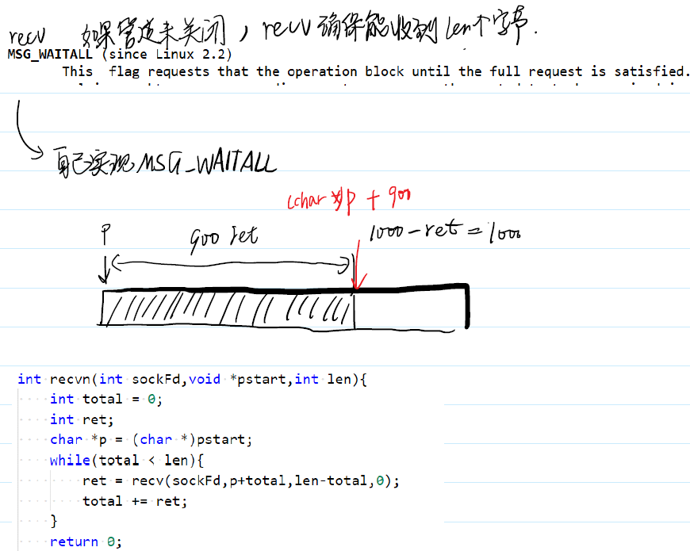

## 3.5 检查文件的正确性
判断这两个文件的内容是否是一致。最好的解决方式是使用md5码来解决问题。
md5 是一种摘要散列算法。它的行为类似于之前的哈希函数。如果两个文件的文件内容是一致的话，那么生成的md5码必然是一致的；如果两个文件的内容不同，只有极小的可以忽略不计的概率两个文件的md5码一致。
如果需要生成一个文件的md5码，需要使用命令md5sum。

>使用truncate命令可以生成指定大小的文件
>truncate -s 600M file2 

## 3.6 封装 recv MSG_WAITALL
为了简化recv的使用，可以考虑将之前带有MSG_WAITALL 参数的recv 封装成recvn
```c
int recvn(int netFd,void* pstart,int len){
    int total=0;
    int ret;
    char *p=(char*)pstart;
    while(total < len)
    {
    ret = recv(netFd,p+total,len-total,0);
    total += ret;//每次接收到的字节数加到total上
    }
    return 0;
}
```


# 4 进程池1.0
下面是一个能够正确下载任意大小文件的进程的代码实现：
## 4.1 客户端
```c
// client.c
#include <myself.h>
typedef struct train_s{
    int length;
    char buf[1000];
}train_t;
int recvn(int sockFd,void *pstart,int len){
    int total = 0;
    int ret;
    char *p = (char *)pstart;
    while(total < len){
        ret = recv(sockFd,p+total,len-total,0);
        total += ret;
    }
    return 0;
}
int recvFile(int sockFd){
    char name[1024] = {0};
    int dataLength;
    int ret = recvn(sockFd,&dataLength,sizeof(int));
    ERROR_CHECK(ret,-1,"recv");
    ret = recvn(sockFd,name,dataLength);
    ERROR_CHECK(ret,-1,"recv");
    int fd = open(name,O_RDWR|O_CREAT|O_TRUNC,0666);
    ERROR_CHECK(fd,-1,"open");
    char buf[1000] = {0};
    while(1){ 
        ret = recvn(sockFd,&dataLength,sizeof(int));
        ERROR_CHECK(ret,-1,"recv");
        if(dataLength != 1000){
            printf("dataLength = %d\n", dataLength);
        }
        if(dataLength == 0){
            break;
        }
        ret = recvn(sockFd,buf,dataLength);
        ERROR_CHECK(ret,-1,"recv");
        write(fd,buf,dataLength);
    }
}
int main(int argc, char *argv[]) {
    // ./cilent 192.168.227.131 1234
    ARGS_CHECK(argc,3);
    int sockFd = socket(AF_INET,SOCK_STREAM,0);
    ERROR_CHECK(sockFd,-1,"socket");
    struct sockaddr_in addr;
    addr.sin_family = AF_INET;
    addr.sin_port = htons(atoi(argv[2]));
    addr.sin_addr.s_addr = inet_addr(argv[1]);
    int ret = connect(sockFd,(struct sockaddr *)&addr,sizeof(addr));
    ERROR_CHECK(ret,-1,"connect");
    recvFile(sockFd);
    close(sockFd);
}
```

## 4.2 服务端
```c
// main.c
#include "worker.h"
#include "head.h"
int main(int argc, char *argv[]){
    //./server 192.168.227.131 1234 3
    // 创建很多子进程
    int workerNum = atoi(argv[3]);
    workerData_t *workerArr = (workerData_t *)calloc(workerNum,sizeof(workerData_t));
    makeChild(workerArr,workerNum);

    // 初始化tcp连接
    int sockFd;
    tcpInit(&sockFd,argv[1],argv[2]);
    
    // 用epoll把tcp连接和子进程管理起来
    int epfd = epoll_create(1);
    epollAdd(sockFd,epfd);
    for(int i = 0; i < workerNum; ++i){
        epollAdd(workerArr[i].pipeFd,epfd);       
    }
    int listenSize = workerNum + 1;
    struct epoll_event *readyArr = (struct epoll_event *)calloc(listenSize,sizeof(struct epoll_event));
    while(1){
        int readyNum = epoll_wait(epfd,readyArr,listenSize,-1);
        printf("epoll_wait ready!\n");
        for(int i = 0; i < readyNum; ++i){
            if(readyArr[i].data.fd == sockFd){
                puts("client connect");
                int netFd = accept(sockFd,NULL,NULL);
                ERROR_CHECK(netFd,-1,"accept");
                for(int j = 0; j < workerNum; ++j){
                    if(workerArr[j].status == FREE){
                        printf("%d worker got a job, pid = %d",j,workerArr[j].pid);
                        sendFd(workerArr[j].pipeFd,netFd); // 把网络连接交给子进程
                        close(netFd);
                        workerArr[j].status = BUSY;
                        break;
                    }
                }
            }
            else{
                puts("one worker finishes his job!\n");
                for(int j = 0; j < workerNum; ++j){
                    if(readyArr[i].data.fd == workerArr[j].pipeFd){
                        pid_t pid;
                        int ret = read(workerArr[j].pipeFd,&pid,sizeof(pid));
                        printf("%d worker finish his job, pid = %d\n",j,pid);
                        workerArr[j].status = FREE;
                        break;
                    }
                }
            }
        }
    }
}

// worker.c
#include "worker.h"
#include "head.h"
int makeChild(workerData_t *workerArr, int workerNum){
    pid_t pid;
    int pipeFd[2];
    for(int i = 0; i < workerNum; ++i){
        socketpair(AF_LOCAL,SOCK_STREAM,0,pipeFd);
        pid = fork();
        if(pid == 0){
            //子进程 确保不会脱离if结构
            close(pipeFd[0]);
            eventHanler(pipeFd[1]);
        }
        //父进程
        close(pipeFd[1]);
        printf("pipeFd = %d, pid = %d\n",pipeFd[0],pid);
        workerArr[i].pipeFd = pipeFd[0];
        workerArr[i].pid = pid;
        workerArr[i].status = FREE;
    }
}
int eventHanler(int pipeFd){
    while(1){
        int netFd;
        recvFd(pipeFd,&netFd);
        // 后续任务加在这里
        printf("I got task!\n");
        transFile(netFd);
        printf("I have done this task!\n");
        pid_t pid = getpid();
        write(pipeFd,&pid,sizeof(pid));
        close(netFd);
    }
}

// tcp.c
// socket bind listen
#include "head.h"
int tcpInit(int *pSockFd, char *ip, char *port){
    *pSockFd = socket(AF_INET,SOCK_STREAM,0);
    ERROR_CHECK(*pSockFd,-1,"socket");
    struct sockaddr_in addr;
    addr.sin_family = AF_INET;
    addr.sin_port = htons(atoi(port));
    addr.sin_addr.s_addr = inet_addr(ip);
    int reuse = 1;
    int ret = setsockopt(*pSockFd,SOL_SOCKET,SO_REUSEADDR,&reuse,sizeof(reuse));
    ERROR_CHECK(ret,-1,"setsockopt");
    ret = bind(*pSockFd,(struct sockaddr *)&addr,sizeof(addr));
    ERROR_CHECK(ret,-1,"bind");
    listen(*pSockFd,10);
}

// epollFunc.c
#include "head.h"
int epollAdd(int fd, int epfd){
    struct epoll_event event;
    event.events = EPOLLIN;
    event.data.fd = fd;
    int ret = epoll_ctl(epfd,EPOLL_CTL_ADD,fd,&event);
    ERROR_CHECK(ret,-1,"epoll_ctl");
    return 0;
}
int epollDel(int fd, int epfd){
    struct epoll_event event;
    event.events = EPOLLIN;
    event.data.fd = fd;
    int ret = epoll_ctl(epfd,EPOLL_CTL_DEL,fd,&event);
    ERROR_CHECK(ret,-1,"epoll_ctl");
    return 0;
}

// sendFd.c
#include <myself.h>
int sendFd(int pipeFd, int fdToSend){
        struct msghdr hdr;
        bzero(&hdr,sizeof(hdr));
        // 传递文本
        struct iovec iov[1]; //长度为1时，离散数据退化为连续
        char buf[10] = "hello";
        iov[0].iov_base = buf;
        iov[0].iov_len = 5;
        hdr.msg_iov = iov;
        hdr.msg_iovlen = 1;
        // 传递控制信息
        struct cmsghdr *pcmsghdr = (struct cmsghdr *)calloc(1,CMSG_LEN(sizeof(int)));
        pcmsghdr->cmsg_len = CMSG_LEN(sizeof(int));
        pcmsghdr->cmsg_level = SOL_SOCKET;
        pcmsghdr->cmsg_type = SCM_RIGHTS;
        *(int *)CMSG_DATA(pcmsghdr) = fdToSend;
        hdr.msg_control = pcmsghdr;
        hdr.msg_controllen = CMSG_LEN(sizeof(int));
        int ret = sendmsg(pipeFd,&hdr,0);
        ERROR_CHECK(ret,-1,"sendmsg");
        return 0;
}
int recvFd(int pipeFd, int *pFdToRecv){
        struct msghdr hdr;
        bzero(&hdr,sizeof(hdr));
        // 传递文本
        struct iovec iov[1]; // 长度为1时，离散数据退化为连续
        char buf[10] = {0};
        iov[0].iov_base = buf;
        iov[0].iov_len = sizeof(buf); //无论什么情况不要写0
        hdr.msg_iov = iov;
        hdr.msg_iovlen = 1;
        // 传递控制信息
        struct cmsghdr *pcmsghdr = (struct cmsghdr *)calloc(1,CMSG_LEN(sizeof(int)));
        pcmsghdr->cmsg_len = CMSG_LEN(sizeof(int));
        pcmsghdr->cmsg_level = SOL_SOCKET;
        pcmsghdr->cmsg_type = SCM_RIGHTS;
        hdr.msg_control = pcmsghdr;
        hdr.msg_controllen = CMSG_LEN(sizeof(int));
        int ret = recvmsg(pipeFd,&hdr,0);
        ERROR_CHECK(ret,-1,"recvmsg");
        *pFdToRecv = *(int *)CMSG_DATA(pcmsghdr);
        return 0;
}

// transFile.c
#include "head.h"
int transFile(int netFd){
    int fd = open("file1",O_RDWR);
    ERROR_CHECK(fd,-1,"open"); 
    train_t train;
    train.length = 5;
    strcpy(train.buf,"file1");
    int ret = send(netFd,&train,sizeof(train.length) + train.length,MSG_NOSIGNAL);
    while(1){
        bzero(&train,sizeof(train));
        ret = read(fd,train.buf,sizeof(train.buf));
        if(ret == 0){
            break;
        }
        train.length = ret;
        ret = send(netFd,&train,sizeof(train.length) + train.length,MSG_NOSIGNAL);
    }
    train.length = 0;
    ret = send(netFd,&train,sizeof(train.length) + train.length,MSG_NOSIGNAL);
    close(fd);
}
```

# 5 进程池的其他功能
## 5.1 进度条显示
首先服务端需要传输一个文件的大小给客户端，以便客户端计算百分比。客户端也需要先接收一个长度的小火车，再读取文件内容，在显示的时候需要控制换行的显示，可以使用fflush 清空缓冲区。
```c
    // 服务端 发送文件大小
    struct stat statbuf;
    ret = fstat(fd,&statbuf);
    ERROR_CHECK(ret,-1,"fstat");
    train.length = 4; // 车厢是4个字节 int
    int fileSize = statbuf.st_size; // 长度转换成 int
    memcpy(train.buf,&fileSize,sizeof(int)); // int 存入小火车
    ret = send(netFd,&train,sizeof(train.length) + train.length,MSG_NOSIGNAL);
    
    // 客户端 进度条
    int fileSize = 0;
    recvn(sockFd,&dataLength,sizeof(int));
    recvn(sockFd,&fileSize,dataLength);
    printf("fileSize = %d\n",fileSize);
    char buf[1000] = {0};
    int doneSize = 0;
    int lastSize = 0;
    int slice = fileSize/10000;
    while(1){ 
        ret = recvn(sockFd,&dataLength,sizeof(int));
        ERROR_CHECK(ret,-1,"recv");
        if(dataLength != 1000){
            printf("dataLength = %d\n", dataLength);
        }
        doneSize += dataLength;
        if(doneSize - lastSize > slice){
            printf("%5.2lf%%\r",100.0*doneSize/fileSize);
            fflush(stdout);
            lastSize = doneSize;
        }
        if(dataLength == 0){
            printf("100.00%%\n");
            break;
        }
        ret = recvn(sockFd,buf,dataLength);
        ERROR_CHECK(ret,-1,"recv");
        write(fd,buf,dataLength);
    }
```

## 5.2 零拷贝、sendfile和splice
目前我们传输文件的时候是采用read 和send 来组合完成。
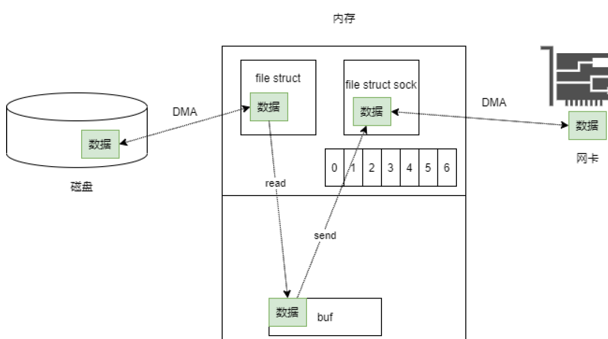
实际上这里涉及了大量的不必要的拷贝操作
如何减少从内核文件缓冲区到用户态空间的拷贝呢？解决方案就是使用mmap 系统调用直接建立文件和用户态空间buf的映射。这样的话数据就减少了一次拷贝。
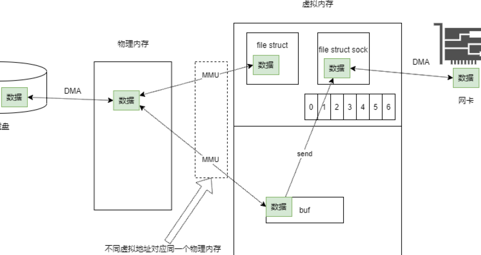

```c
    // 服务端 分批发送
    char *p = (char *)mmap(NULL,statbuf.st_size,PROT_READ|PROT_WRITE,MAP_SHARED,fd,0);
    ERROR_CHECK(p,MAP_FAILED,"mmap");
    int total = 0;
    while(total < fileSize){
        if(fileSize - total < sizeof(train.buf)){
            train.length = fileSize - total;
        }
        else{
            train.length = sizeof(train.buf);
        }
        memcpy(train.buf,p+total,train.length);
        send(netFd,&train,train.length + sizeof(train.length),MSG_NOSIGNAL);
        total += train.length;
    }
    train.length = 0;
    ret = send(netFd,&train,sizeof(train.length) + train.length,MSG_NOSIGNAL);
    close(fd);
    munmap(p,fileSize);
```
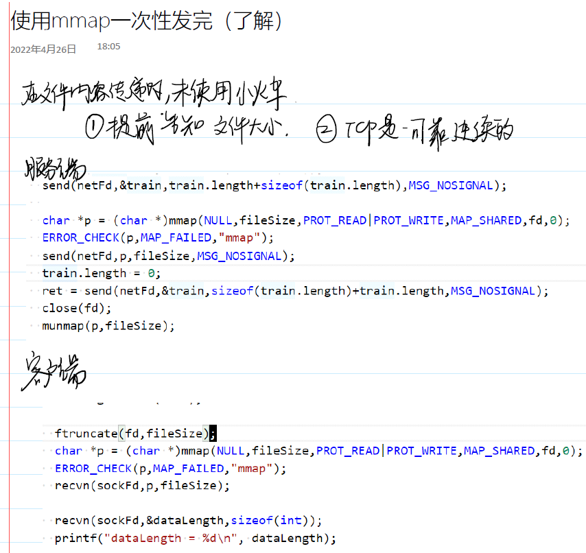

## 5.3 进程池的退出

# 6 线程池的实现