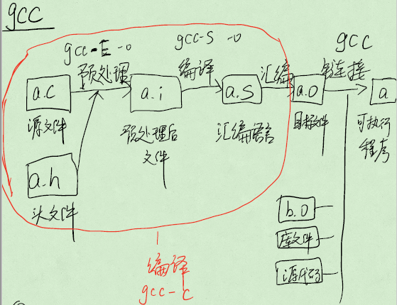
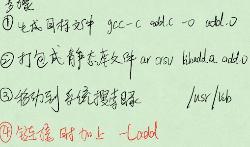
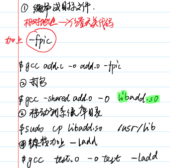
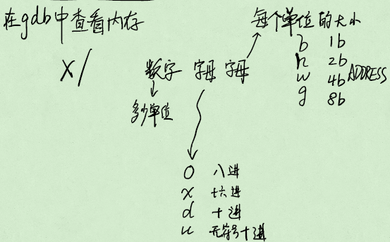
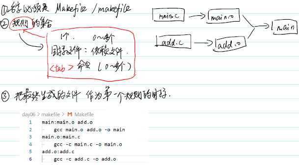

# gcc

## 编译
* 预处理 gcc -E
* 编译 gcc -S
* 汇编 as
* gcc -D 相当于加#define
* gcc -I 增加搜索路径
* gcc -O 编译优化(0不优化，1产品，2开源，3。优化越深C与汇编对应乱)
* gcc -wall

## 链接
目标文件 gcc -c
库文件
引导代码

连接过程把函数名字->地址
ld 直接调用
gcc 间接调用 -函数/全局变量未定义或多次定义/缺少main函数 连接错误
链接生成可执行程序 ./文件名 执行程序

## 库文件
：公用的工具，特殊的目标文件，他人写好的公开发行的。
静态库  先生成产品

动态库  运行过程中加入产品

# 调试

## 编译选项
-g 补充调试信息
-O0 不开优化

## gdb
gdb- GNU Debugger
gdb 文件名

## 命令
* list / l [文件名:] [行号] | [函数名]   看文件内容
* run / r     运行程序
* break / b   [文件名:] [行号] | [函数名] 打断点
* continue / c    继续运行
* step / s 相当 vs F11
* next / n 相当于vs F10
* finish  跳出本次函数调用
* info break / i b    查看断点信息
* delete [num]    删除断点
* ignore  [num] [count]   忽略 num 断点 n 次

## 监视
* print / p 表达式
* diaplay   表达式 删除 先 info dispaly 再 undisplay

## 查看内存

## 出错调试
core文件 - 程序崩溃时刻内存的堆栈
Segmentation fault 段错误
1. 编译加上 -g -O0
2. ulimit -c unlimited
3. 执行程序
4. gdb 可执行 core

# makefile
## **遵循增量编译**
“目标：依赖” 只有目标不存在/目标比依赖旧 才执行命令

## 规则

## 伪目标
设定一个一定执行的指令
1. 目标不存在
2. 执行命令生成不了目标

## 变量
1. 自定义变量
    变量名：=值 字符串类型 
    引用变量 $(变量名)
2. 预定义变量
    \$(CC),$(RM)
3. 自动变量
    同一变量名，值随着规则而变化
    \$^ 所有依赖 $@ 目标

## %匹配符
用在第二个规则，按格式从上一个规则的以来部分匹配

## 函数
$(wildcard *.c) 从当前目录所有文件中，取出符合要求的文件名

\$(patsubst %.c,%.o,$(src)) 从第三个参数中按照第一个参数的格式匹配并转为第二个参数

