# 线程
# 1 从进程到线程
进程是正在执行的程序，并且是系统资源分配的基本单位。
计算机花费了大量的时间在切换不同的进程上面。
当一个进程在执行过程中，CPU的寄存器当中需要保存一些必要的信息，比如堆栈、代码段等，这些状态称作上下文。
为了缩小切换进程的开销，线程的概念便诞生了。线程又被称为轻量级进程。
线程就取代进程成为CPU时间片的分配和调度的最小单位，在Linux操作系统当中，每个线程都拥有自己独立的task_struct 结构体。
属于同一个进程的多个线程会共享进程地址空间，每个线程在执行过程会在地址空间中有自己独立的栈，而堆、数据段、代码段、文件描述符和信号屏蔽字等资源则是共享的。
线程切换只需要切换栈和PC指针以及其他少量控制信息即可

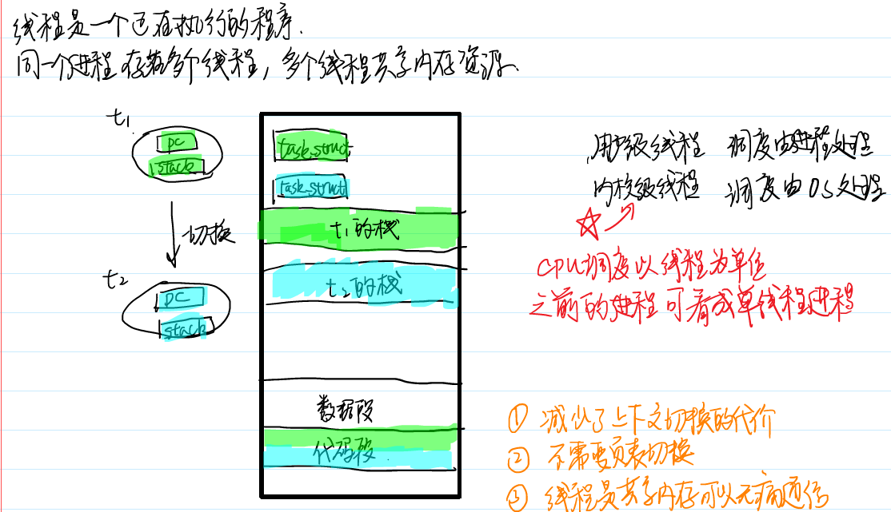

## 用户级线程和内核级线程
线程可以分为用户级线程和内核级线程。操作系统内核无法调度用户级线程，所以通常会存在一个管理线程
目前使用最广泛的线程库名为NPTL。之前是用户态线程，之后1:1映射到内核态线程。

# 2 线程的创建和终止
常用的线程库函数和之前的进程的对应关系。
pthread_create 创建一个线程  fork
pthread_exit  线程退出  exit
pthread_join  等待线程结束并回收资源  wait
pthread_self  获取线程id  getpid

注：在使用线程相关的函数之后，在链接时需要加上-pthread 选项

## 2.1 线程函数的错误处理
之前的POSIX系统调用和库函数在调用出错的时候，通常会把全局变量errno 设置为一个特别的数值以指示报错的类型,这样就可以调用perror 以显示符合人阅读需求的报错信息。

但是在多线程编程之中很容易被并发地读写，所以pthread系列的函数不会通过修改errno 来指示报错的类型，它会根据不同的错误类型返回不同的返回值，使用strerror 函数可以根据返回值显示报错字符串。

```c
char *strerror(int errnum);
#define THREAD_ERROR_CHECK(ret,msg) {if(ret!=0){\
fprintf(stderr,"%s:%s\n",msg,strerror(ret));}}
```

## 2.2 创建线程
线程创建使用的函数是 pthread_create
int pthread_create(pthread_t *thread, const pthread_attr_t *attr,void *(*start_routine) (void *), void *arg);
* 创建者需要分配空间去存储一个线程id，并且将其地址传入
* attr 参数可以用来指定创建出来的线程的属性. NULL - 默认
* start_routine 是一个函数指针类型的参数。地位相当于主线程的 main ,作为线程执行的入口函数。
* arg 是传递给start_routine 的参数。

不同线程都拥有自己独立唯一的线程id，NPTL使用pthread_t类型来保存线程id，了linux里是一个无符号长整型数。使用函数 pthread_self 可以获取本线程的id。

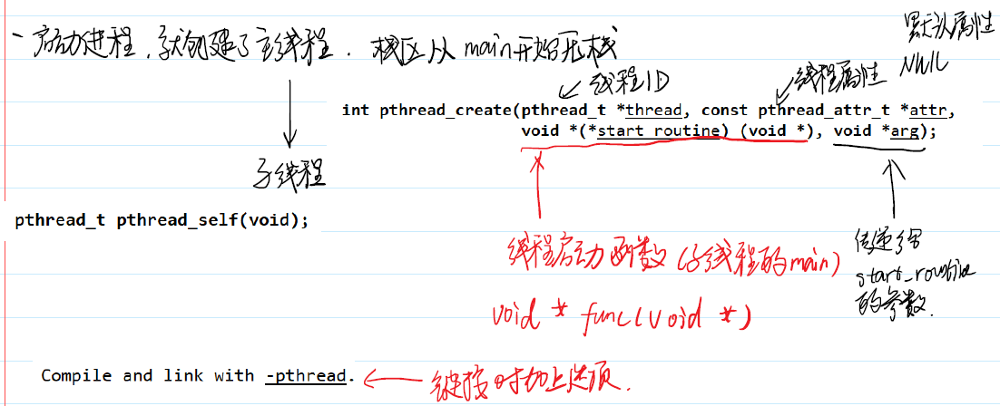

## 2.3 线程和数据共享
多个线程是共享一片地址空间的，所以各个线程可以并发地访问的同一个数据段、堆空间和其他位置。

堆空间自然也是可以共享的，我们通过将堆空间的首地址作为参数在创建线程的时候进行传递

虽然各个线程执行的过程中拥有自己独立的栈区，但是这些所有的栈区都是在同一个地址空间当中，所以一个线程完全可以访问到另一个线程栈帧内部的数据。

arg 是一个void* 类型的参数
想要共享 用指针
想要传递 用long

各个线程执行的过程中拥有自己独立的栈区，但是这些所有的栈区都是在同一个地址空间当中，所以一个线程完全可以访问到另一个线程栈帧内部的数据。

## 2.4 线程主动退出
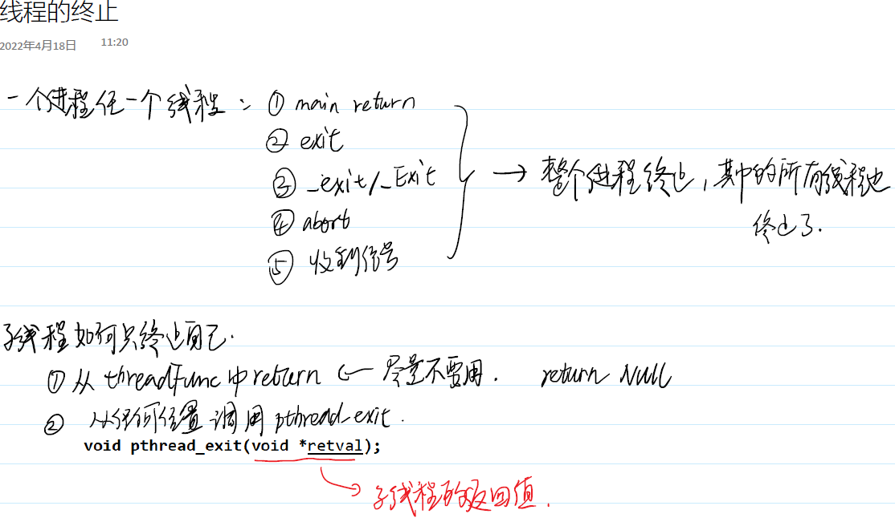

使用pthread_exit 函数可以主动退出线程，
void pthread_exit(void *retval);
参数：void * 类型值，描述了线程的退出状态。

## 2.5 获取线程退出状态
pthread_join 使本线程处于等待状态，直到指定的thread 终止，捕获到的线程终止状态存入retval 指针所指向的内存空间中。
int pthread_join(pthread_t thread, void **retval);

线程的终止状态是一个void * 类型的数据，所以pthread_join 的调用者需要先申请8个字节大小的内存空间，然后将其首地址传入，在
pthread_join 执行之后，里面的数据会被修改

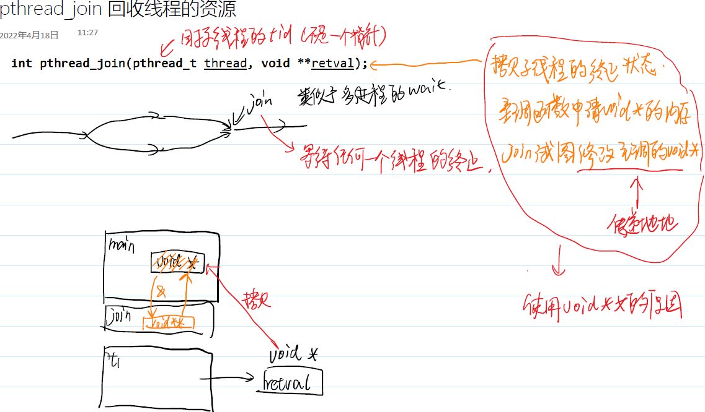

# 3 线程的取消和资源清理
## 3.1 线程的取消
线程除了可以主动退出以外，还可以被另一个线程终止。
不能轻易地在多线程程序使用信号，因为多线程是共享代码段的。
当一个线程调用pthread_cancel 去取消另一个线程的时候，另一个线程会将本线程的取消标志位设置为真，当这个线程执行一些函数之时，线程就会退出。这些会导致已取消未终止的线程终止的函数称为取消点。

* int pthread_cancel(pthread_t thread);

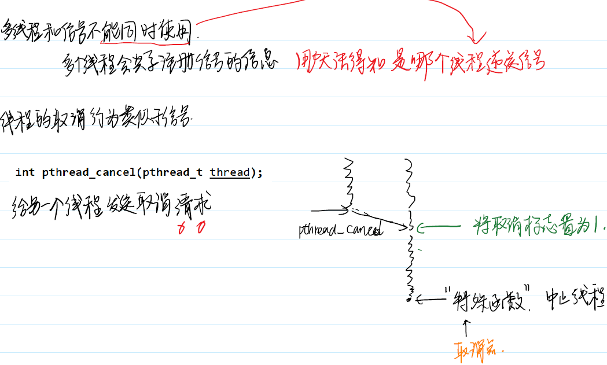

通常来说，会引起阻塞或者是访问文件的操作就是取消点

使用命令ps -elLf 可以查看线程的状态。

如果需要手打添加取消点，可以调pthread_testcancel 函数。
* void pthread_testcancel(void);

pthread_cacancel 流程分析


## 3.2 线程资源清理
pthread_cleanup_push 和pthread_cleanup_pop 函数来管理线程主动或者被动终止时所申请资源（比如文件、堆空间、锁等等）。
void pthread_cleanup_push(void (*routine)(void *),void *arg);
void pthread_cleanup_pop(int execute);

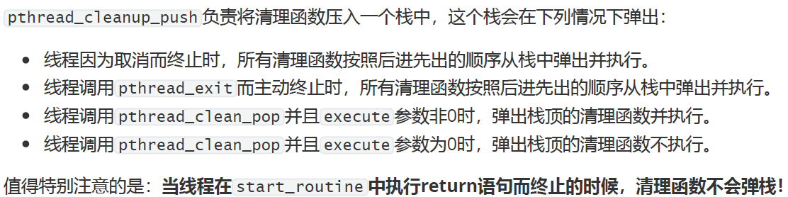

push和pop，必须在同一作用域中成对出现。

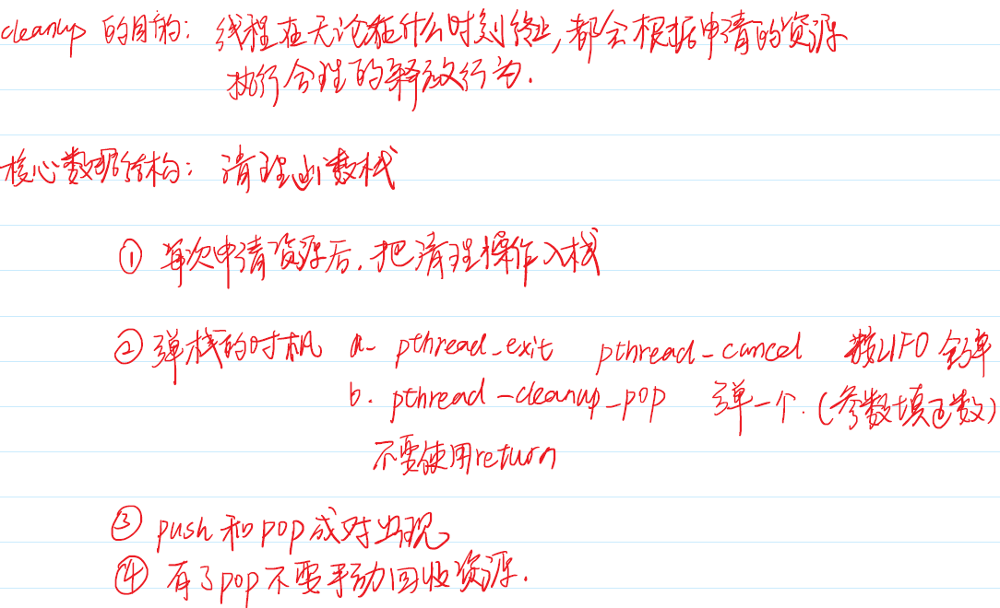

# 4 线程的同步和互斥
由于多线程之间不存在隔离，在并发执行的情况下，大量的共享资源成为竞争条件

## 4.1 互斥锁的基本使用
在多线程编程中，用来控制共享资源的最简单有效也是最广泛使用的机制就是mutex(MUTualEXclusion) ，即互斥锁。

锁的数据类型是pthread_mutex_t。锁在某个时刻永远不能被两个线程同时持有。

编程规范要求：谁加锁，谁解锁。

使用pthread_mutex_init 函数可以动态创建一个锁。
使用pthread_mutex_destory 可以销毁一个锁。

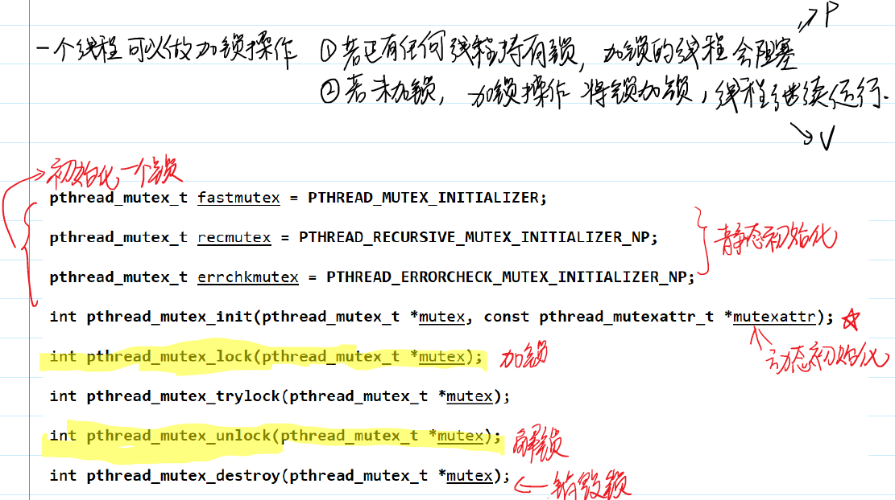

## 4.2 使用互斥锁访问共享资源
，如果在每次访问共享资源的时候都正确地使用锁（即访问之前加锁，访问之后解锁），那么程序就会得到正确的运行结果。

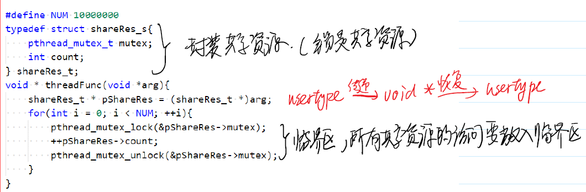

可以使用pthread_mutex_trylock 函数来非阻塞地加锁，假如已经加锁成功，函数会直接返回。

## 4.3 死锁
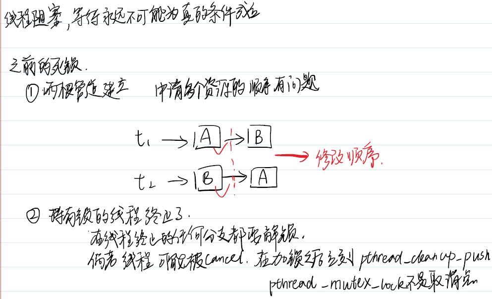
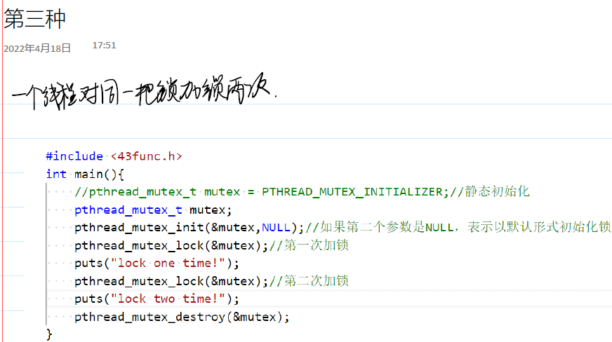

## 4.4 条件变量


# 5 线程的属性


# 6 线程安全与可重入性
