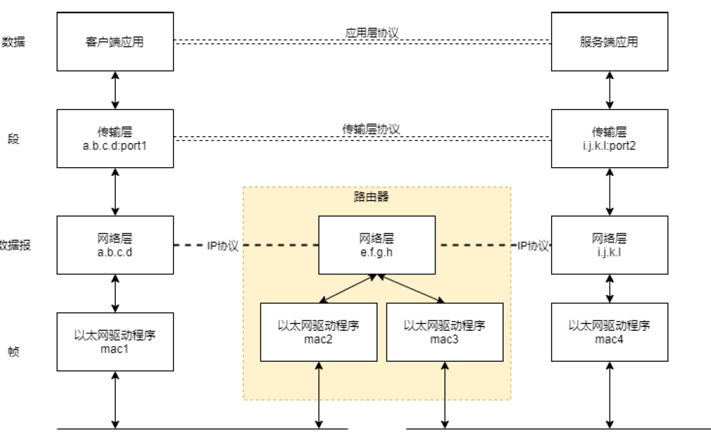

# 网络和网络编程

# 1 网络协议和网络模型
在使用网络通信时，可以认为是由一端程序发起了请求而由另一端回复了一个响应。发起请求的那一端称作客户端，响应的那一端称作服务端。

网络协议规定了通信两端数据交互的规则。层次之间存在着上下层关系，上层依赖于下层，它需要调用下层提供的接口才能工作。

OSI网络模型有七层模型：分别是应用层、表示层、会话层、传输层、网络层、数据链路层和物理层，但是目前广泛使用的是TCP/IP协议族网络模型，它是四层模型：从上往下依次是应用层、传输层、网络层和网络接口层。

网络协议是针对同一层之间的通信生效的
在网络编程的学习过程中，最重要的参考资源是RFC文档。

# 2 TCP/IP协议族概览
## 2.1 四层模型的各层实体
在四层模型当中，完成每一层功能的实体如下：
* 物理层：通常指实际传输的物理设备，比如线缆、调制解调器等设备，数据在这些设备中以比特流的形式就行传播。
* 数据链路层：通常是指网卡的驱动程序。该层将比特流转换成数据帧，MAC地址是用来描述不同的数据链路层设备的地址。
* 网络层：通常指不同的主机。网络层负责将数据帧封装成IP数据报。使用IP地址来描述主机在网络层的位置。网络层之间采用逐机跳转的通信方式。
* 传输层：负责将IP数据报封装成TCP段或UDP报文。该层可以为两台主机的应用程序提供端到端的通信。传输层只关心通信的起始端和目的端，不关心数据的中转过程。
* 应用层：负责处理应用程序的逻辑。

每个层次能够处理的数据单位称作 协议数据单元（PDU），不同层次之间的协议数据单元也是不同的，数据在上层下层之间传递时，需要使用一定的手段转换协议数据单元。

## 2.2 协议数据单元的转移
当数据从上层转移到下层时，下层的数据单元会把上层数据单元的所有内容包含进来。作为下层协议数据单元的有效载荷，除此还需要在头部或者是尾部增加下层的控制信息。其中TCP段/UDP报文会在数据中增加端口等信息作为头部。IP数据报会在TCP段/UDP报文的内容头部的添加IP地址等控制信息。

数据链路层帧的处理会相对复杂一点。在数据链路层存在一个MTU参数。它的数值决定了数据帧有效载荷的最大长度（单位是字节），长度超过MTU的数据帧将无法传递到网络层。常用的MTU值有1500、576等，而IP数据报总长度上限为65535个字节。

## 2.3 常见协议以及分层

## 2.4 ifconfig
ipconfig命令（Windows版本是ipconfig）可以展示本地网卡的信息，其中ens33（有些系统是使用eth0）是表示以太网网卡，而lo表示loopback本地回环设备。

## 2.5 本地环回设备
在有些情况，通信的服务端和客户端会位于同一台主机之上，操作系统提供了一种环回网络接口来实现同一主机上两端通信，环回设备是一种虚拟的网络设备

# 3 以太网
## 3.1 以太网和交换机
以太网是最常用的数据链路层标准之一。
网桥和交换机（就是高性能版网桥）是工作在数据链路层(L2)上的设备，它们可以用来将多个链路层网络连接起来，从而构成一个拓展的局域网。

## 3.2 以太网帧
以太网中处理的协议数据单元是以太网帧，目的地址（6字节）、源地址（6字节）、类型（2字节）、变长的数据（46~1500字节，所以以太网的MTU是1500）和CRC（4个字节）。
1. 在目的地址和源地址字段当中填写的是设备的硬件地址
（MAC地址），而不是主机的IP地址。
2. 类型字段中说明以太网帧载荷的类型
3. 数据字段的长度范围是46字节到1500字节，如果IP数据报的内容不足46个字节，则会在末尾填充（padding）上0。
4. CRC部分是一种校验码，用于校验数据传递过程是否出现比特跳变

## 3.3 ARP协议
在网络传输中，我们使用IP地址来定位主机的位置，通常来说IP地址的选择是任意的，但是网络设备在链路层上的MAC地址是由生产厂商分配是固定的。

需要使用一种协议来执行地址解析，即IP地址和MAC地址之间的映射转换--这就是ARP协议的作用

> 当一台主机接入网络之后，假如它需要向自己所在局域网的设备发送数据，那么它就需要知道邻居IP地址和MAC地址之间的映射关系。
> 主机会发送一个ARP请求，ARP请求会向在一个共享的链路层网段上所有主机发送（广播，此时以太网帧的目的MAC每一位都填1），并且获取这个问题的答案“谁拥有IP192.168.3.1，请告知自己的MAC地址？”。IP地址不是192.168.3.1的设备会忽略此请求，但是拥有IP地址192.168.3.1的设备会直接回复一个ARP应答给源主机，在接收到应答之后，源主机再向192.168.3.1发送数据就不再需要广播而是直接交付了。

使用抓包和分析工具的过程
1. 指定要抓取的网卡
2. 开始捕获 -> 停止
3. 输入表达式进行筛选

# 4 IP协议
IP协议是四层模型中的核心协议，所有TCP、UDP、ICMP数据都通过IP数据报传输。
IP提供一种尽力而为（就是不可靠）、无连接的数据报交付服务。
不可靠意味着如果传递过程中出现差错，IP层可以选择丢弃数据，并且不会主动重传；
无连接意味着IP协议不会记录传递过程中的路径，那同样的两端发生的不同数据报可能会走不同的路径，并且有可能不按顺序到达。

## 4.1 IP地址以及其分类
IP地址用来区分不同的主机在网络层中的位置。
IPv4:32位，为了方便描述，通常将其按8位一组分隔，并用.号隔开，这种就是点分十进制
IPv6:128位，一般用8个4位十六进制描述，每个十六进制数描述一个段。
IPv6可以解决IP地址缺乏的问题，但是随着NAT技术的广泛使用，IPv4目前实际上还是占据了大部分市场。

在早期，每个IP地址会分为两部分，高位是网络号，低位是主机号。
一种相对自由的划分方式就是采用子网机制：把主机号的前缀作为子网ID，剩余部分作为主机ID，主机ID的长度由本地网络管理员自行划定。

子网掩码用来描述主机ID的长度，其长度和IP地址一样是32，其中高位部分全为1，剩余的部分全为0。
前缀部分的长度说明网络号和子网ID的长度，剩余部分自然就是主机ID了。

## 4.2 IP数据报的结构
正常的IPv4头部大小为20个字节
IP头部的传输按照大端法（网络字节序）进行的，对于一个32位值而言，首先传输高位8位，然后次高8位。由于大部分PC使用的是小端法，所以在构造完头部之后传输之前需要对其执行大小端转换才行。

- 版本：4位，数值4指IPv4，6指IPv6。
- 头部字段：4位，用来描述IP数据报头部的长度为多少32位。因此IP数据报头部最多只有60个字节。
- 服务类型：8位，描述服务质量和拥塞情况
- 总长度：16位，描述IP数据报的总长度（包括头部）为多少字节。最长65535字节
- 标识：16位，描述IP数据报的分片编号，同一个大IP数据报分解出来的多个分片拥有相同的标识。
- 标志：3位，描述是否发生分片，以及是否后续有更多的分片。
- 片偏移：13位，描述该分片在重组后的大IP数据报当中的位置，以8字节为单位。
- 生存期（TTL）：8位，描述一个数据报可以经过路由器的上限，每次路由器转发时该数值会减一。
这个属性可以避免在环形路由情况下，数据报在网络中永远循环。
- 协议：8位，描述上层协议的类型，最常见的是1(ICMP)、17(UDP)和6(TCP)
- 首部校验和：16位，IP数据报头部的校验和
- 源IP地址和目的IP地址：各有32位，描述IP数据报的发送者和接收者的IP地址。

## 4.3 分片和重组
由于IP数据报的总长度限制为65535字节，远远超过了部分链路层标准的MTU，当数据从网络层准备转移到数据链路层时，网络层会将IP数据报进行分片操作，分解成若干个独立的IP数据报（分解之后IP数据的总长度字段改变了），并且在网络之间独立传输。一旦到达终点的目的主机之后（中间不会重组），目的主机的网络层会将分片重组成一个大IP数据报。

## 4.4 路由器
链路层的数据是采用多跳的方式进行通信，也就是一个主机实际上只能决定数据报下一跳能转发到哪一个邻居，而不能直接和最终的目的地建立连接。
在这种逐跳通信的网络之中寻找来源和目的之间一条合适的通路过程以及最终生成的通路称为路由。

路由器是一种拥有两个以上的接口的网络设备，它们工作在网络层(L3)，路由器在经过一定的路由决策之后，可以将数据从一个接口转发到另一个接口。路由器可以充当一个端到端通信系统当中的中间结点。部分主机也支持路由功能。

路由器的主要功能就是IP转发，它需要维护一个数据结构，称作路由表，表的每一行会拥有如下信息：
* 目的地：32位字段，和掩码合在一起工作，用以描述目的IP地址。0.0.0.0表示所有目的地，完整的IP地址表示一个直接相连的主机。
* 掩码：和目的地址合在一起使用，用来表示目标主机或者目标网段
* 下一跳：数据报真正会被转发到的地址。0.0.0.0表示在同一个链路上，可以直接在数据链路层进行传输。
从路由表的信息可以看到，路由器和主机不包含到任何目的地址的完整转发路径，除非目的主机直接和其相连。
如果目的地是直接相连的主机，那么数据报就是直接通过链路层传输到目的主机，否则的话，数据报会发送给路由器（网关），再由路由器进行转发，以间接交付的形式最终到达目的地。

## 4.5 NAT简述
NAT的本质就是在不同的地方使用重复的IP地址。我们可以把网络分解成Internet和内部网络，内部网络当中只有少量的结点直接和Internet连接，并且被分配了IP地址。

NAT的原理就是重写通过路由器的数据报的识别信息。
具体而言，就是在离开内部网络的时候重写数据报的源地址为公网地址，进入内部网络的时候将目的地址从公网地址改成内网地址。
应用NAT之后，内部网络之外的所有主机将无法从外网主动发起对内部结点的连接，也就是内部结点无法充当服务端。

## 4.6 ping 和 ICMP
Internet报文控制协议（ICMP）和IP结合使用，以便提供与IP协议层配置和IP数据包处置相关的诊断和控制信息。ICMP一般认为是网络层的一部分，但是它的实现却需要基于IP，ICMP数据包是放置在IP数据报之中，所以可以认为ICMP是一种位于网络层和传输层之间的协议。

# 5 TCP协议

# 6 UDP协议